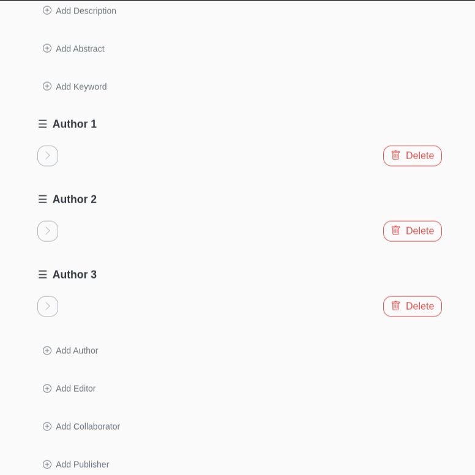

import { Aside, Code, Tabs, TabItem } from '@astrojs/starlight/components';

The `resources/display_rules.yaml` file is the heart of HERITRACE's user interface customization. It allows you to control how data is presented and handled without touching a single line of code. This configuration determines how different types of entities are displayed, what properties are visible, and how forms behave for creating and editing data.

In short, this file lets you transform raw RDF data into a user-friendly and intuitive experience for domain experts.

<Aside type="note" title="Display Rules and SHACL Integration">
Display Rules work in conjunction with SHACL schemas. While Display Rules control presentation and user interface behavior, SHACL schemas define data validation and available properties. **Display Rules cannot override SHACL constraints** - they can only style and configure properties that are already defined in SHACL shapes. For detailed information about their interaction, see the [SHACL and Display Rules Interaction section](/heritrace/configuration/shacl/#shacl-and-display-rules-interaction).
</Aside>

## File Location

By default, the display rules file is `resources/display_rules.yaml` in the project's root directory. You can change this path in your `config.py` file:

```python
DISPLAY_RULES_PATH = 'resources/display_rules.yaml'
```

## Core Concepts

The configuration is a list of rules. Each rule targets a specific type of entity and defines how it and its properties should be handled.

### Targeting Entities

You can target entities with rules in three ways, allowing for granular control.

<Tabs>
<TabItem label="By Class">
You can target all entities of a specific RDF class.

```yaml
# Targets all entities that are a fabio:JournalArticle
- target:
    class: "http://purl.org/spar/fabio/JournalArticle"
  # ... other settings
```
</TabItem>
<TabItem label="By SHACL Shape">
You can target entities that conform to a specific SHACL shape. This is useful for distinguishing between entities of the same class that have different characteristics (e.g., a standard issue vs. a special issue).

```yaml
# Targets all entities that conform to SpecialIssueShape
- target:
    shape: "http://schema.org/SpecialIssueShape"
  # ... other settings
```
</TabItem>
<TabItem label="By Class and Shape">
For maximum precision, you can target entities that belong to a specific class AND conform to a specific shape.

```yaml
# Targets entities that are a fabio:JournalIssue AND conform to RegularIssueShape
- target:
    class: "http://purl.org/spar/fabio/JournalIssue"
    shape: "http://schema.org/RegularIssueShape"
  # ... other settings
```
</TabItem>
</Tabs>

When an entity could be targeted by multiple rules (e.g., it has multiple types), the rule with the lower `priority` number is applied.

```yaml
- target:
    class: "http://purl.org/spar/fabio/JournalArticle"
  priority: 1 # Higher priority
  # ...
- target:
    class: "http://purl.org/spar/fabio/Expression"
  priority: 2 # Lower priority
  # ...
```

### Key Rule Settings

Here are the top-level settings for each rule:

-   `displayName`: A human-readable name for the entity type (e.g., "Journal Article"). This is shown in the UI.
-   `shouldBeDisplayed`: A boolean (`true` or `false`). If `true`, this entity type will appear in the catalogue and can be created via the "New Record" interface.
-   `fetchUriDisplay`: A SPARQL query that creates a user-friendly label for an entity. This is crucial for usability, as it replaces technical URIs with meaningful text.
-   `similarity_properties`: A list of properties used to check for potential duplicates when a user creates a new entity.
-   `displayProperties`: A list defining how each property of the entity should be displayed and behave.
-   `sortableBy`: A list of properties that users can use to sort items in the catalogue view.

## Displaying Entity Labels with `fetchUriDisplay`

While URIs are great for machines, they are not user-friendly. The `fetchUriDisplay` setting allows you to define a human-readable label for an entity type using a SPARQL query. This label is used throughout the HERITRACE interface, for instance, in search results and breadcrumbs, to represent the entity.

The query uses `[[uri]]` as a placeholder, which HERITRACE dynamically replaces with the URI of the entity being displayed.

Your SPARQL query for `fetchUriDisplay` **must `SELECT` a single variable**. This variable holds the final formatted string that will be shown to the user.

You can find many practical examples of this in the default `resources/display_rules.yaml` file.

```yaml
# Example for a Journal Volume
- target:
    class: "http://purl.org/spar/fabio/JournalVolume"
  fetchUriDisplay: |
    PREFIX fabio: <http://purl.org/spar/fabio/>
    PREFIX frbr: <http://purl.org/vocab/frbr/core#>
    PREFIX dcterms: <http://purl.org/dc/terms/>
    SELECT ?display
    WHERE {
      [[uri]] fabio:hasSequenceIdentifier ?number ;
              frbr:partOf ?journal .
      ?journal dcterms:title ?journalTitle .
      BIND(CONCAT("Volume ", ?number, " of ", ?journalTitle) AS ?display)
    }
```
This configuration takes a `JournalVolume` entity and displays it as "Volume [number] of [Journal Title]", which is much clearer than its URI.

## Configuring Properties (`displayProperties`)

This is where you define the behavior of each field in the entity view and edit forms.

### Basic Property

A simple property configuration might look like this:

```yaml
- property: "http://purl.org/dc/terms/title"
  displayName: "Title"
  shouldBeDisplayed: true
  inputType: "textarea"
```

-   `property`: The URI of the RDF property.
-   `displayName`: The label shown in the UI.
-   `shouldBeDisplayed`: If `true`, the property is visible.
-   `inputType`: Defines the form field. Common types include `text`, `textarea`, `date`, and `tag`.

### Search and Disambiguation

You can enable real-time search to prevent duplicate entries.

```yaml
- property: "http://purl.org/dc/terms/title"
  displayName: "Title"
  supportsSearch: true
  minCharsForSearch: 3
  searchTarget: "self"
```

-   `supportsSearch`: Set to `true` to enable search-as-you-type.
-   `minCharsForSearch`: The number of characters a user must type before the search is triggered.
-   `searchTarget`:
    -   `self`: Searches for entities of the same type with a matching property value (e.g., finding other articles with a similar title).
    -   `parent`: Use this when a property links to a separate but related entity. This setting ensures that a search for the related entity's value returns the main (parent) entity. For example, if a bibliographic resource is linked to an `Identifier` entity (which holds a DOI), a search for the DOI value should return the resource itself, not the `Identifier` entity.

### Custom Value Display with `fetchValueFromQuery`

<Aside type="note" title="`fetchUriDisplay` vs. `fetchValueFromQuery`">
It's important to understand the distinction:
-   **`fetchUriDisplay`** defines the label for the **entity itself**. Its query returns a single string.
-   **`fetchValueFromQuery`** defines the label for the **value of a property**, which is often a link to another entity. Its query returns two variables: the display string and the URI of the linked entity.
</Aside>

Sometimes, a property's value is not a simple literal but another entity that needs a formatted display. For this, you can use `fetchValueFromQuery`.

The provided SPARQL query must `SELECT` two variables in a specific order: first, the formatted string to display in the UI, and second, the URI of the linked entity.

For example, an identifier is an entity itself, but we want to display it as `doi:10.1234/567`.

```yaml
- property: "http://purl.org/spar/datacite/hasIdentifier"
  displayName: "Identifier"
  fetchValueFromQuery: |
    PREFIX datacite: <http://purl.org/spar/datacite/>
    PREFIX literal: <http://www.essepuntato.it/2010/06/literalreification/>
    SELECT (CONCAT(STRAFTER(STR(?scheme), "http://purl.org/spar/datacite/"), ":", ?literal) AS ?id) ?identifier
    WHERE {
        [[subject]] datacite:hasIdentifier ?identifier.
        VALUES (?identifier) {([[value]])}
        ?identifier datacite:usesIdentifierScheme ?scheme;
                    literal:hasLiteralValue ?literal.
    }
```
<Aside>
The query uses `[[subject]]` and `[[value]]` as placeholders that HERITRACE replaces with the URI of the current entity and property value, respectively.
</Aside>

### Ordering Items (`orderedBy`)

When the order of multiple values for a property is significant (e.g., the sequence of authors for a paper), you can use the `orderedBy` key. It specifies the RDF predicate that defines this order. When `orderedBy` is configured, the interface will display drag-and-drop handles, allowing users to reorder the items manually.



```yaml
- property: "http://purl.org/spar/pro/isDocumentContextFor"
  orderedBy: "https://w3id.org/oc/ontology/hasNext"
  # ... other settings
```

#### How it Works: RDF Representation

When a user arranges items, HERITRACE uses the specified `orderedBy` property to create a linked list that connects the items sequentially. This approach is model-agnostic; it can order any set of related resources, whether they are direct properties or linked through an intermediate proxy entity.

For instance, if a resource has multiple related items and their order matters, the RDF structure would look like this:

```turtle
@prefix ex: <http://example.org/ontology/> .
@prefix : <http://example.org/instance/> .

# :myResource is linked to three items.
# The order in this triple declaration is not significant.
:myResource ex:hasItem :item1, :item2, :item3 .

# The 'orderedBy' property (ex:hasNext) creates a chain.
:item1 ex:hasNext :item2 .
:item2 ex:hasNext :item3 .

# :item3 has no ex:hasNext, marking it as the end of the list.
```

<Aside type="note" title="Work in Progress">
Currently, HERITRACE supports modeling order using a sequential property to form a linked list. We plan to support other ordering patterns, such as using an index property, in future releases.
</Aside>

### Relationship Properties (Proxy Pattern)

Sometimes a simple link between two entities isn't enough. You might need to describe the relationship itself. For example, a person can be an author of an article, but they could also be an editor. How do you capture this specific role?

This is solved with a **Proxy Pattern**, which uses an intermediate entity to hold the properties of the relationship.

**The data model looks like this:**
`Journal Article` → `isDocumentContextFor` → `Role In Time` → `isHeldBy` → `Person`

The `Role In Time` entity is the "proxy." It holds the details, like the specific role (`pro:author` or `pro:editor`).

Here is how you configure this complex relationship in `display_rules.yaml`:

```yaml
- property: "http://purl.org/spar/pro/isDocumentContextFor"
  orderedBy: "https://w3id.org/oc/ontology/hasNext" # Optional: property to sort items
  intermediateRelation:
    class: "http://purl.org/spar/pro/RoleInTime"
    targetEntityType: "http://xmlns.com/foaf/0.1/Agent"
  displayRules:
    - shape: "http://schema.org/AuthorShape"
      displayName: "Author"
      fetchValueFromQuery: |
        # This query's context is the proxy entity.
        # It gets the name of the final target entity (the Agent).
        PREFIX pro: <http://purl.org/spar/pro/>
        PREFIX foaf: <http://xmlns.com/foaf/0.1/>
        SELECT DISTINCT ?formattedName ?ra WHERE {
          # [[value]] is the URI of the RoleInTime entity
          [[value]] pro:isHeldBy ?ra;
              pro:withRole pro:author.
          ?ra foaf:name ?formattedName.
        }
    - shape: "http://schema.org/EditorShape"
      displayName: "Editor"
      fetchValueFromQuery: |
        # A similar query for editors...
```

**Breaking down the configuration:**

-   `property`: The property on the source entity (`Journal Article`) that points to the proxy entities.
-   `orderedBy`: (Optional) Specifies a property used to create an ordered sequence between the proxy entities, ensuring they are displayed in the correct order (e.g., for a list of authors). When `orderedBy` is used, HERITRACE displays drag-and-drop handles next to each item, allowing users to reorder them manually.
-   `intermediateRelation`: This is the core of the proxy configuration.
    -   `class`: The `rdf:type` of the proxy entity (`pro:RoleInTime`).
    -   `targetEntityType`: The `rdf:type` of the final entity you want to link to (`foaf:Agent`). HERITRACE uses this to know what kind of entity to create or search for.
-   `displayRules`: A list that allows you to handle different kinds of relationships managed under the same main `property`.
    -   `shape`: HERITRACE uses the SHACL shape of the *proxy entity* to distinguish between roles. For example, both authors and editors are `pro:RoleInTime` entities, but they conform to different shapes (`AuthorShape`, `EditorShape`).
    -   `displayName`: A clean label for the UI ("Author", "Editor").
    -   `fetchValueFromQuery`: A SPARQL query to get the display text. **Important:** The context for this query (`[[value]]`) is the proxy entity's URI. The query must navigate *from* the proxy to the final target to get its name.

This configuration tells HERITRACE how to navigate the proxy relationship, distinguish between different roles using SHACL shapes, and display the final linked entity correctly in the user interface.

## Best Practice: Keep it DRY with YAML Anchors

To avoid repeating the same queries or property definitions, use YAML anchors (`&`) and aliases (`*`). This makes your configuration file shorter and much easier to maintain.

```yaml
# 1. Define reusable queries and properties at the top
queries:
  author_query: &author_query |
    PREFIX pro: <http://purl.org/spar/pro/>
    PREFIX foaf: <http://xmlns.com/foaf/0.1/>
    SELECT DISTINCT ?formattedName ?ra WHERE {
      [[value]] pro:isHeldBy ?ra;
          pro:withRole pro:author.
      ?ra foaf:name ?formattedName.
    }

common_properties:
  title_property: &title_property
    property: "http://purl.org/dc/terms/title"
    displayName: "Title"
    shouldBeDisplayed: true
    inputType: "textarea"
    supportsSearch: true

# 2. Use aliases in your rules
rules:
  - target:
      class: "http://purl.org/spar/fabio/JournalArticle"
    displayProperties:
      - *title_property # Use the title property definition
      - property: "http://purl.org/spar/pro/isDocumentContextFor"
        displayRules:
          - shape: "http://schema.org/AuthorShape"
            displayName: "Author"
            fetchValueFromQuery: *author_query # Use the author query
```

## Testing Your Rules

When running HERITRACE in development mode, any changes to `resources/display_rules.yaml` will automatically restart the server, so you can see your updates instantly.