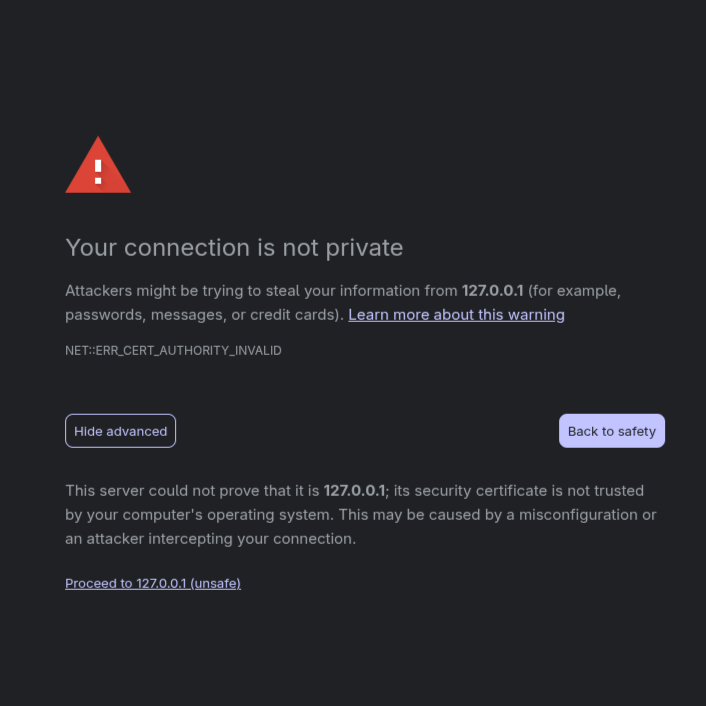

import { Tabs, TabItem } from '@astrojs/starlight/components';

This guide will get HERITRACE running on your local machine in just a few steps.

## Prerequisites

- <a href="https://docs.docker.com/get-docker/" target="_blank" rel="noopener noreferrer">Docker and Docker Compose installed</a>
- <a href="https://git-scm.com/downloads" target="_blank" rel="noopener noreferrer">Git</a> for cloning the repository
- Modern web browser

## 1. Clone the Repository

```bash
git clone https://github.com/opencitations/heritrace.git
```

```bash
cd heritrace
```

## 2. Configure the Application

Copy the example configuration file:

```bash
cp config.example.py config.py
```

**Required:** Configure ORCID authentication (mandatory for the application to work):

1. **Create an ORCID account** at <a href="https://orcid.org/register" target="_blank" rel="noopener noreferrer">orcid.org</a> if you don't have one
2. **Get ORCID credentials** at <a href="https://orcid.org/developer-tools" target="_blank" rel="noopener noreferrer">ORCID Developer Tools</a>:
   - Create a new application
   - Set redirect URI to: `https://127.0.0.1:5000/auth/callback`
   - Note your Client ID and Client Secret

3. **Edit `config.py`** with your ORCID credentials:

```python
# Required ORCID configuration
ORCID_CLIENT_ID = 'APP-XXXXXXXXXX'  # From ORCID registration
ORCID_CLIENT_SECRET = 'xxxxxxxx-xxxx-xxxx-xxxx-xxxxxxxxxxxx'  # From ORCID
ORCID_WHITELIST = ['0000-0000-0000-0000']  # Your ORCID ID

# Optional: Customize display (can be changed later)
APP_TITLE = 'Your HERITRACE Instance'
# Optional for startup, but important for security
SECRET_KEY = 'your-secure-secret-key-here'
```

## 3. Start the Databases

:::note
Make sure Docker Engine (Linux/MacOS) or Docker Desktop (Windows) is running before executing these commands.
:::

<Tabs>
  <TabItem label="Linux/MacOS">
    ```bash
    ./start-databases.sh
    ```
  </TabItem>
  <TabItem label="Windows">
    ```powershell
    .\Start-Databases.ps1
    ```
  </TabItem>
</Tabs>

This starts two Virtuoso database instances:
- Dataset database on port 8999
- Provenance database on port 8998

## 4. Launch HERITRACE

<Tabs>
  <TabItem label="Development Mode">
    ```bash
    docker compose -f docker-compose.dev.yaml up --build
    ```
  </TabItem>
  <TabItem label="Production Mode">
    ```bash
    docker compose up
    ```
  </TabItem>
</Tabs>

:::note
This automatically starts all required services including:
- HERITRACE web application (port 5000)
- Redis for resource locking and counters (port 6379)
- All dependencies are managed automatically by Docker Compose
:::

## 5. Access the Application

Open your browser and navigate to:

```
https://127.0.0.1:5000
```

:::caution[SSL Certificate Warning]
**Development Mode**: HERITRACE uses a self-signed SSL certificate, so your browser will show a security warning. Click "Advanced" and "Proceed to 127.0.0.1:5000 (unsafe)" to continue.

The following image shows an example of this warning:



**Production Mode**: Requires a valid SSL certificate and public domain for ORCID authentication to work, as ORCID only accepts HTTPS callbacks. Without these, ORCID will reject authentication requests. For initial testing, use development mode.
:::

## Pre-configured Data Model

HERITRACE comes preloaded with validation and display rules based on a customized version of the <a href="https://doi.org/10.1007/978-3-030-62466-8_28" target="_blank" rel="noopener noreferrer">OpenCitations Data Model (OCDM)</a>:

- **SHACL Schema** (`resources/shacl.ttl`): Defines the data model, classes, and properties.
- **YAML Display Rules** (`resources/display_rules.yaml`): Configure how entities appear in the interface

These rules can be fully customized for your specific needs while maintaining semantic integrity.

## What's Next?

Now that HERITRACE is running, you can:

1. **Explore the Interface**: Navigate through the metadata management features with the preconfigured data model
2. **Configure Schemas**: Customize the [SHACL schema](/configuration/shacl/) for your data model
3. **Set Display Rules**: Modify the [YAML display rules](/configuration/display-rules/) for your interface
4. **Advanced Configuration**: Review [additional settings](/configuration/app-settings/) for production use

## Stopping the Application

When you're done, stop the services:

<Tabs>
  <TabItem label="Stop Application">
    ```bash
    # Press Ctrl+C in the terminal running docker compose
    # Or run:
    docker compose down
    ```
  </TabItem>
  <TabItem label="Stop Databases">
    **Linux/MacOS:**
    ```bash
    ./stop-databases.sh
    ```
    
    **Windows:**
    ```powershell
    .\Stop-Databases.ps1
    ```
  </TabItem>
</Tabs>

## Troubleshooting

### Port Already in Use
If you get port conflicts, check if other services are running on the required ports:

<Tabs>
  <TabItem label="Linux">
    ```bash
    # Modern Linux (ss command - usually preinstalled)
    ss -tulpn | grep -E ':(5000|6379|8998|8999)\s'
    ```
  </TabItem>
  <TabItem label="macOS">
    ```bash
    netstat -an | grep -E ':(5000|6379|8998|8999)\s'
    ```
  </TabItem>
  <TabItem label="Windows">
    ```cmd
    # Check ports using netstat
    netstat -ano | findstr ":5000 :6379 :8998 :8999"
    
    # Or using PowerShell
    Get-NetTCPConnection | Where-Object {$_.LocalPort -in 5000,6379,8998,8999}
    ```
  </TabItem>
</Tabs>

### Need Help?
- Review [configuration options](/configuration/app-settings/) for advanced setup
- Use `docker compose logs` to check application logs for specific errors
- Visit the <a href="https://github.com/opencitations/heritrace" target="_blank" rel="noopener noreferrer">GitHub repository</a> for issues and support 