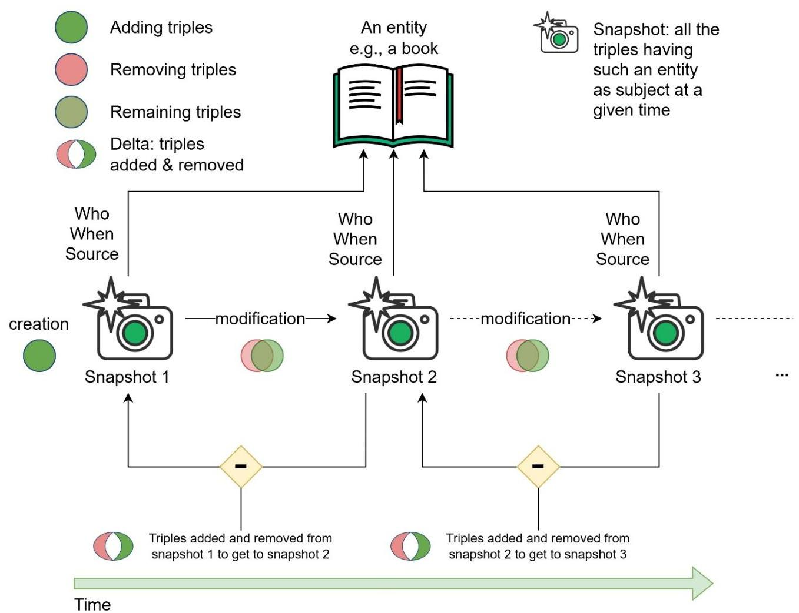
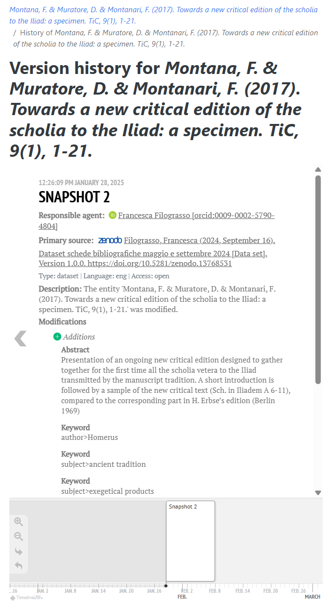

HERITRACE (Heritage Enhanced Repository Interface for Tracing, Research, Archival Curation, and Engagement) is a semantic data editor designed for galleries, libraries, archives, and museums (GLAM) that bridges the gap between sophisticated semantic technologies and the practical needs of cultural heritage professionals.

## The challenge

The widespread adoption of Semantic Web technologies in the GLAM sector has created a paradoxical situation. While these technologies have made human intervention more critical due to the semantic interpretation of data that cannot be automated, they have simultaneously limited the number of curators to those who are experts in the Semantic Web. This creates challenges in workforce scalability and accessibility.

Many GLAM institutions face a choice between embracing Semantic Web technologies (requiring staff with advanced technical expertise) or avoiding them entirely to prevent curatorial complexities. HERITRACE resolves this dilemma by enabling non-technical domain experts to manage semantic data intuitively without losing its semantic integrity.

## Purpose and objectives

HERITRACE has been designed with five primary objectives:

1. **User-Friendly Interface**: Providing an intuitive interface for domain experts to interact with semantic data without technical knowledge
2. **Comprehensive Provenance Management**: Implementing detailed documentation of metadata modifications, including who made changes, when, and from what sources
3. **Robust Change-Tracking**: Delivering efficient version control capabilities for reconstruction of previous data states
4. **Flexible Customization**: Offering standardized configuration through SHACL and YAML rather than proprietary solutions
5. **Seamless Integration**: Facilitating compatibility with pre-existing RDF data collections without modification

## Target users

### End users (GLAM professionals)
- Librarians managing bibliographic records
- Archivists cataloguing collections  
- Museum curators organizing metadata
- Academic researchers working with bibliographic data

Domain experts can enrich and edit metadata through an intuitive interface without knowing anything about the Semantic Web, while the system maintains complete semantic integrity behind the scenes.

### Technical users (developers and system administrators)
- System administrators deploying and maintaining HERITRACE
- Developers customizing schemas through SHACL definitions
- IT professionals configuring YAML display rules and database connections

Technical staff can customize HERITRACE through standardized languages (SHACL for data validation, YAML for interface configuration) rather than learning proprietary templating systems.

## Key features

### Provenance management and change tracking
HERITRACE employs the <a href="https://doi.org/10.1007/978-3-030-62466-8_28" target="_blank">OpenCitations Data Model (OCDM)</a> extending the <a href="https://www.w3.org/TR/prov-o/" target="_blank">PROV Ontology</a> to implement comprehensive provenance management. Every modification is captured as a snapshot with complete metadata including:
- Timestamp of creation/invalidation
- Responsible agent (individual, organization, or automated process)
- Primary data source
- Detailed list of modifications made

Change tracking uses a delta-based approach storing only differences between successive snapshots as SPARQL update queries, enabling efficient storage and precise restoration of previous versions.

### Time machine and Time vault
The **Time Machine** feature provides a timeline interface for managing entity evolution, allowing users to view previous versions and restore earlier states with automatic adjustment of linked resources. The **Time Vault** serves as a specialized catalog for deleted entities, enabling recovery when needed.

### Intelligent metadata management
- **Real-time Validation**: SHACL-based constraints ensure data consistency and integrity
- **Smart Disambiguation**: Automatic detection of similar entities during creation to prevent duplication
- **Dynamic Field Configuration**: Interface adapts based on entity type and defined schemas
- **Semantic Relationship Management**: Handle complex relationships between entities with proper validation

### Seamless RDF integration
HERITRACE functions effectively out of the box with existing RDF datasets. Simply connect to your triplestore - no data transformation or special import procedures required. The system automatically discovers and displays entities based on their RDF types.

## Technical foundation

HERITRACE is built using modern web technologies optimized for semantic data management:

- **Backend**: Python <a href="https://flask.palletsprojects.com/" target="_blank">Flask</a> framework with <a href="https://rdflib.readthedocs.io/" target="_blank">RDFlib</a> for RDF processing and <a href="https://github.com/opencitations/time-agnostic-library" target="_blank">Time-agnostic Library</a> for managing version reconstruction
- **Database**: Database-agnostic architecture supporting any RDF triplestore. Tested with <a href="https://virtuoso.openlinksw.com/" target="_blank">Virtuoso</a> and Blazegraph, but also compatible with GraphDB and Apache Jena. Virtuoso is recommended as it is open source and actively maintained, while Blazegraph is no longer maintained
- **Frontend**: <a href="https://jinja.palletsprojects.com/" target="_blank">Jinja2</a> templating engine with <a href="https://react.dev/" target="_blank">React</a> components for interactive elements requiring reactivity
- **Standards Compliance**: Built on <a href="https://www.w3.org/RDF/" target="_blank">RDF</a>, <a href="https://www.w3.org/TR/sparql11-query/" target="_blank">SPARQL</a>, <a href="https://www.w3.org/TR/shacl/" target="_blank">SHACL</a>, and <a href="https://www.w3.org/TR/prov-o/" target="_blank">PROV-O</a> standards
- **Authentication**: <a href="https://orcid.org/" target="_blank">ORCID</a> OAuth integration with access control
- **Deployment**: <a href="https://www.docker.com/" target="_blank">Docker</a> and Docker Compose support for easy installation
- **Customization**: <a href="https://www.w3.org/TR/shacl/" target="_blank">SHACL</a> for data model definition, <a href="https://yaml.org/" target="_blank">YAML</a> for display rule configuration

## Real-world deployment

HERITRACE is currently deployed in the ParaText project at the University of Bologna, managing bibliographic metadata for textual resources. The system is also planned for adoption by OpenCitations, demonstrating its scalability for large-scale, dynamic datasets in real production environments.