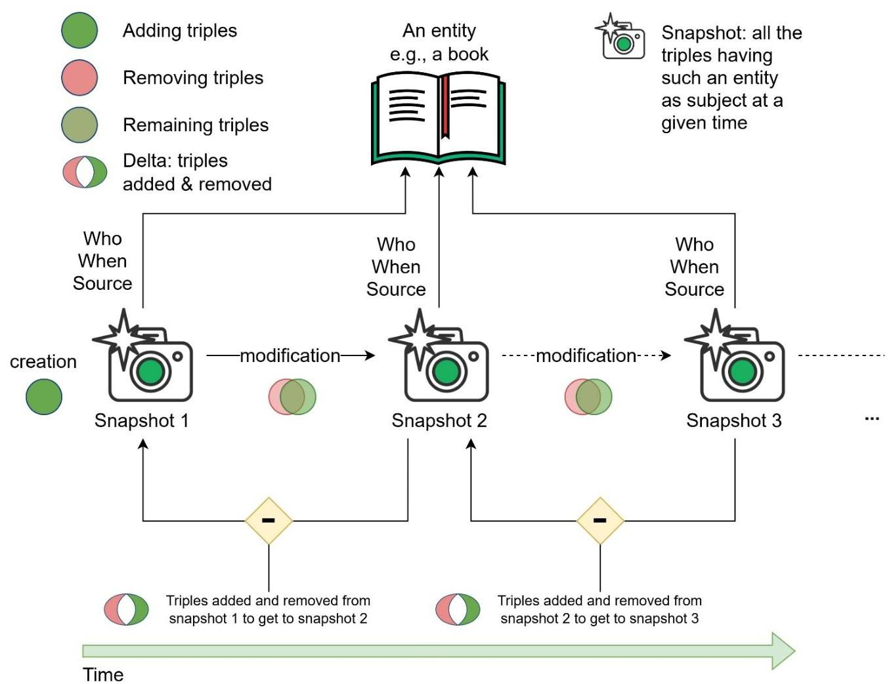
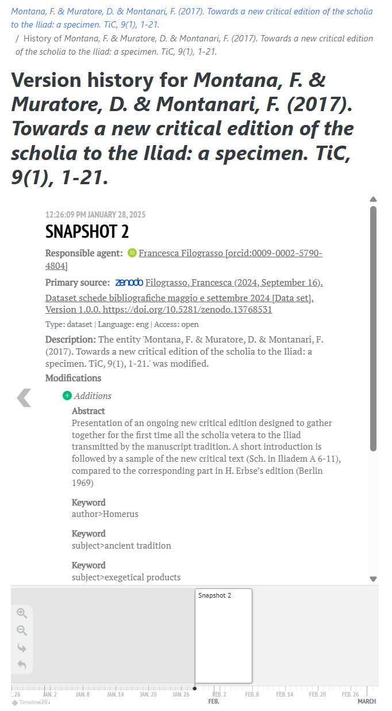

HERITRACE (Heritage Enhanced Repository Interface for Tracing, Research, Archival Curation, and Engagement) is a web-based semantic data editor. It allows users to work with RDF data through a web interface, without requiring knowledge of semantic technologies.

## The problem

Working with RDF data typically requires technical expertise. This limits who can curate and edit metadata: either an organization adopts semantic standards and restricts editing to technical staff, or it avoids them altogether.

HERITRACE removes this trade-off. Users interact with their data through forms and familiar UI patterns, while the system maintains semantic validity, handles provenance and change tracking, and stores everything as standard RDF.

## What HERITRACE does

- Presents semantic data through an interface that doesn't expose RDF, SPARQL, or ontology details to end users
- Records who changed what, when, and from which source, using the OpenCitations Data Model (OCDM) and PROV-O
- Tracks changes as deltas between versions, allowing reconstruction and restoration of previous states
- Uses SHACL for data validation and form generation, and YAML for display configuration, rather than proprietary templating
- Connects to existing RDF triplestores directly, with no data transformation or import step required

## Key features

### Provenance management and change tracking
HERITRACE uses the <a href="https://doi.org/10.1007/978-3-030-62466-8_28" target="_blank">OpenCitations Data Model (OCDM)</a> extending the <a href="https://www.w3.org/TR/prov-o/" target="_blank">PROV Ontology</a> to track provenance. Every modification is captured as a snapshot with:
- Timestamp of creation/invalidation
- Responsible agent (individual, organization, or automated process)
- Primary data source
- List of modifications made

Changes are stored as deltas between successive snapshots (SPARQL update queries), keeping storage efficient and allowing precise restoration of previous versions.

### Time machine and time vault
The time machine shows a timeline of an entity's versions. Users can view any previous state and restore it; linked resources are adjusted automatically. The time vault is a catalogue of deleted entities that can be recovered.

### Metadata management
- **Real-time validation**: SHACL constraints check data as it is entered
- **Disambiguation**: During creation, HERITRACE detects similar existing entities to prevent duplicates
- **Dynamic forms**: The interface adapts its fields based on entity type and SHACL definitions
- **Relationship handling**: Entities can be linked with validation against the defined schema

### RDF integration
HERITRACE works out of the box with existing RDF datasets. Connect to your triplestore and the system discovers and displays entities based on their RDF types. No data transformation or import step is needed.

## Technical foundation

- **Backend**: Python <a href="https://flask.palletsprojects.com/" target="_blank">Flask</a> with <a href="https://rdflib.readthedocs.io/" target="_blank">RDFlib</a> for RDF processing and <a href="https://github.com/opencitations/time-agnostic-library" target="_blank">Time-agnostic Library</a> for version reconstruction
- **Database**: Any RDF triplestore. Tested with <a href="https://virtuoso.openlinksw.com/" target="_blank">Virtuoso</a> and Blazegraph; also compatible with GraphDB and Apache Jena. Virtuoso is recommended (open source, actively maintained; Blazegraph is no longer maintained)
- **Frontend**: <a href="https://jinja.palletsprojects.com/" target="_blank">Jinja2</a> templates with <a href="https://react.dev/" target="_blank">React</a> components for interactive elements
- **Standards**: <a href="https://www.w3.org/RDF/" target="_blank">RDF</a>, <a href="https://www.w3.org/TR/sparql11-query/" target="_blank">SPARQL</a>, <a href="https://www.w3.org/TR/shacl/" target="_blank">SHACL</a>, <a href="https://www.w3.org/TR/prov-o/" target="_blank">PROV-O</a>
- **Authentication**: <a href="https://orcid.org/" target="_blank">ORCID</a> OAuth with access control
- **Deployment**: <a href="https://www.docker.com/" target="_blank">Docker</a> and Docker Compose
- **Customization**: <a href="https://www.w3.org/TR/shacl/" target="_blank">SHACL</a> for data models, <a href="https://yaml.org/" target="_blank">YAML</a> for display rules
