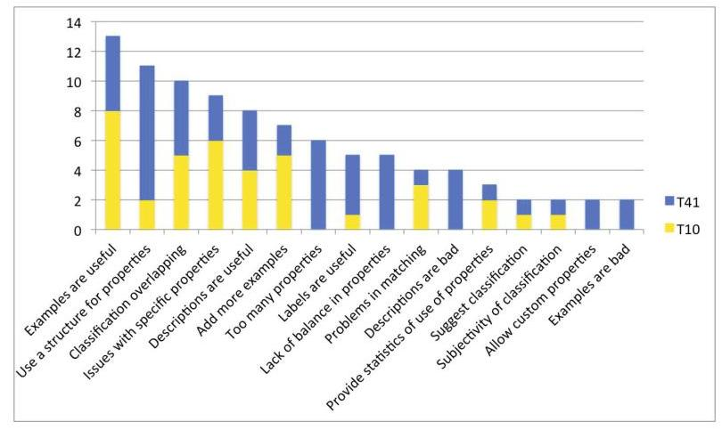

# Evaluating Citation Functions in CiTO: Cognitive Issues 

Paolo Ciancarini ${ }^{1,2}$, Angelo Di Iorio ${ }^{1}$, Andrea Giovanni Nuzzolese ${ }^{1,2}$, Silvio Peroni ${ }^{1,2}$, and Fabio Vitali ${ }^{1}$<br>${ }^{1}$ Department of Computer Science and Engineering, University of Bologna, Italy<br>${ }^{2}$ STLab-ISTC, Consiglio Nazionale delle Ricerche, Italy<br>\{ciancarini, diiorio, nuzzoles, fabio\}@cs.unibo.it, silvio.peroni@unibo.it


#### Abstract

Networks of citations are a key tool for referencing, disseminating and evaluating research results. The task of characterising the functional role of citations in scientific literature is very difficult, not only for software agents but for humans, too. The main problem is that the mental models of different annotators hardly ever converge to a single shared opinion. The goal of this paper is to investigate how an existing reference model for classifying citations, namely CiTO (Citation Typing Ontology), is interpreted and used by annotators of scientific literature. We present an experiment capturing the cognitive processes behind subjects' decisions in annotating papers with CiTO, and we provide initial ideas to refine future releases of CiTO.


Keywords: \#eswc2014Ciancarini, CiTO, citation functions, human inter-rater agreement, mental models, usability, user testing session.

## 1 Introduction

The interest in alternative ways for publishing scientific results is rapidly increasing, especially for the Semantic Web community that is producing a lot of scientific data as linked datasets which can be browsed and reasoned on 15 [11. On the other hand, most of the current scientific production is still disseminated by "traditional" papers, and citations remain the key tools to connect, explore and evaluate research works.

Citations are not all equal, as discussed by 31. The frequency a work is cited is a partial indicator of its relevance for a community. More effective results can be obtained by looking for the citation functions, i.e. "the author's reasons for citing a given paper" 30. Yet, it is extremely difficult to characterise the nature of a citation univocally.

A fairly successful classification model is CiTO (Citation Typing Ontology) 1 22], an OWL ontology for describing factual as well as rhetorical functions of citations in scientific articles and other scholarly works. CiTO defines forty-one

[^0]
[^0]:    ${ }^{1}$ CiTO: http://purl.org/spar/cito

properties that allow users to characterise precisely the semantics of a citation act. CiTO has been successfully used in large projects like CiteULike 2 and Data.open.ac.uk 3 , and several tools have been developed to annotate citations with CiTO properties directly via browser ${ }^{4}$ or CMS plugins ${ }^{5}$.

Despite (or possibly because of) the richness and variety of CiTO properties, most users actually employ a sub-set of these properties: a smaller set of properties is easier to memorise and handle, some properties are not perceived as precise in specific domains, some others are considered too similar to each others, and so on. For instance, Pensoft Publishers ${ }^{6}$ (to our knowledge, the first commercial user of CiTO ) are going to enable authors to annotate their citations according to six CiTO properties only. The Link to Link Wordpress plugin supports about ten properties.

This paper introduces an experimental analysis on how the CiTO model is accepted, understood, and adopted by humans. In particular, it presents an experiement with two conditions, i.e., the use of the full set of CiTO properties and the use of a specific subset of them. In addition, the paper discusses the outcomes of the experiment along with the feedback provided by the subjects. The goal is to validate and assess the usability of CiTO and to distill guidelines for a more effective use of the current ontology and for improvements to the future releases. Also, we want to study human's behaviour in order to simulate it within $\mathrm{CiTalO}^{7}$ [10, a chain of tools for identifying automatically the nature of citations. The most critical aspect identified by our experiment is that opinions about the most appropriate CiTO properties are often misaligned. Unsurprisingly, each reader relies on a different mental model, and the reader's model can be and often is different from the one of the authors of the CiTO annotation, which in turn can be and often is different from the one of the authors of the citation in the paper.

This paper is structured as follows: in Section 2 we review previous works on classification of citations. In Section 3 we present CiTO and relate it with humans' mental models. In Section 4 and Section 5 we introduce our experimental setting and findings. In Section 6 we discuss the lesson learnt and sketch out some possible developments of CiTO and CiTalO.

# 2 Related Works 

The analysis of networks of citations is gaining more and more attention. Copestake et al. 7] present an infrastructure, called SciBorg, based on NLP techniques

[^0]
[^0]:    ${ }^{2}$ CiteULike homepage: http://www.citeulike.org
    ${ }^{3}$ Open Linked Data from The Open University: http://data.open.ac.uk
    ${ }^{4}$ CiTO Reference Annotation Tools for Google Chrome:
    https://chrome.google.com/webstore/detail/annotate-journal-citation/ geajighoohelnjnhfmhbcaddbcgcbphn
    ${ }^{5}$ Link to Link Wordpress plugin: http://wordpress.org/plugins/link-to-link/
    ${ }^{6}$ PenSoft Publishers homepage: http://www.pensoft.net/
    ${ }^{7}$ CiTalO homepage: http://wit.istc.cnr.it:8080/tools/citalo

that allows one to automatically extract semantic characterisations of scientific texts. In particular, they developed a module for discourse and citation analysis based on the approach proposed by Teufel et al. [28] called Argumentative Zoning $(A Z)$. AZ provides a procedural mechanism to annotate sentences of an article according to one out of seven classes of a given annotation scheme (i.e. background, own, aim, textual, contrast, basis and other), thus interpreting the intended authors' motivation behind scientific content and citations.

Teufel et al. [29] 30] study the function of citations - that they define as "author's reason for citing a given paper" - and provide a categorisation of possible citation functions organised in twelve classes, in turn clustered in Negative, Neutral and Positive rhetorical functions. In addition, they performed some tests involving hundreds of articles in computational linguistics (stored as XML files), several human annotators and a machine learning approach for the automatic annotation of citation functions. The results were quite promising; however the agreement between human annotators (i.e. $\mathrm{K}=0.72$ ) is still higher than the one between the human annotators and the machine learning approach (i.e. K $=0.57$ ).

Jorg [14] analysed the ACL Anthology Networks ${ }^{8}$ and found one hundred fifty cue verbs, i.e. verbs usually used to carry important information about the nature of citations: based on, outperform, focus on, extend, etc. She maps cue verbs to classes of citation functions according to the classification provided by Moravcsik et al. [19] and makes the bases to the development of a formal citation ontology. This works actually represent one of the sources of inspiration of CiTO (the Citation Typing Ontology) developed by Peroni et al. [22], which is an ontology that permits the motivations of an author when referring to another document to be captured and described by using Semantic Web technologies such as RDF and OWL.

Closely related to the annotation of citation functions, Athar [1] proposes a sentiment-analysis approach to citations, so as to identify whether a particular act of citing was done with positive (e.g. praising a previous work on a certain topic) or negative intentions (e.g. criticising the results obtained through a particular method). Starting from empirical results Athar et al. [2] expand the above study and show how the correct sentiment (in particular, a negative sentiment) of a particular citation usually does not emerge from the citation sentence - i.e. the sentence that contains the actual pointer to the bibliographic reference of the cited paper. Rather, it actually becomes evident in the last part of the considered context window ${ }^{9}$ [23].

Hou et al. [13] use an alternative approach to understand the relevance (seen as a form of positive connotation/sentiment) of citations: the citation counting in a text. Paraphrasing the authors, the idea is that the more a paper is cited within a text, the more its scientific contribution is significative.

[^0]
[^0]:    ${ }^{8}$ ACL Anthology Network: http://clair.eecs.umich.edu/aan/index.php
    ${ }^{9}$ The context window [23] of a citation is a chain of sentences implicitly referring to the citation itself, which usually starts from the citation sentence and involves few more subsequent sentences where that citation is still implicit 3].

# 3 Users' Adoption of CiTO 

There are several reference models to characterise citations, as presented in the previous section. One of the most used within the Semantic Web domain is CiTO [22]. The ontology basically defines a property cites (and its inverse isCitedBy) and 41 sub-properties (each of which has its own inverse) that describe the semantics of a citation act.

The richness of properties is a key feature of CiTO. To the best of our knowledge, there is no other OWL ontology that provides a set of properties for annotating citation types as rich as CiTO. This aspect has contributed to the adoption of the ontology by the Semantic Publishing 25] community, which is currently exploiting CiTO in projects like CiteULike, Data.open.ac.uk, and the Open Citation Corpus 26 .

On the other hand, the richness of CiTO is perceived as a hindrance by some annotators. We studied the actual adoption of the model within these projects and discovered that most tools actually employ a sub-set of the CiTO properties (CiTO-Ps on the rest of the text). For instance, Pensoft Publishers are going to enable authors to annotate their citations according to only six CiTO-Ps i.e., citesAsDataSource, related, critiques, supports, reviews and discusses - while the Link to Link Wordpress plugin allows users to specify the generic function cites and some of its sub-properties: citesAsSourceDocument, confirms, extends, obtainsBackgroundFrom, reviews, supports, usesDataFrom, usesMethodIn, and disagreesWith.

We believe that one of the reasons for this fragmented adoption is that CiTO was developed with a top-down approach: the authors of the ontology, supported by a group of experts and end-users, and with the help of previous works on this topic, studied collections of scientific papers and citation patterns and came up with a set of properties that was incrementally refined.

The goal of this work is to assess and validate the CiTO-Ps from a bottom-up perspective. This approach is complementary to the current CiTO development process and allows us to study how CiTO-Ps are actually perceived by humans in the task of annotating citations.

### 3.1 CiTO Annotations and Mental Models

One of the most relevant issues we found is that multiple views coexist and often conflict when performing an annotation task with CiTO. We can see three steps in this process: (i) the interpretation of the text so as to guess the citation function as it was originally conceived by the author, (ii) the understanding of the CiTO-Ps and (iii) the creation of a mapping between the supposed function of a citation and the most appropriate CiTO property.

For each step, each annotator creates her/his own mental model. Mental models were introduced in 1943 by Craik [8 as small-scale models of reality that the humans' mind uses to anticipate events. For most cognitive scientists today, a mental model is an internal scale-model representation of an external reality. It is built on-the-fly, from knowledge of prior experience, schema segments, perception, and problem-solving strategies 9. In Human-Computer Interaction (HCI)

mental models are detected for improving the usability of a system. It is commonly accepted that humans interact with systems based on a set of beliefs ${ }^{10}$ about how a system works [20].

This also applies to CiTO processes: humans annotate a citation based on a set of beliefs that they obtain by only interpreting the citation's context and finding an appropriate property in CiTO according to their interpretation of the ontology. Our goal is to study these beliefs and the mental models built by the humans. The work is based on the hypothesis that usability is tied strongly to the extent to which these models match and predicts the action of a system, as suggested by [9]. The overall objective is to reduce the gap between the System Model, the mental model constructed by the ontology engineer while modelling CiTO-Ps, and the User Model, the mental model constructed by a user for understanding how to use CiTO-Ps.

# 4 Experimental Analysis of CiTO Use 

In order to assess how CiTO is used to annotate scholarly articles, we compared the classifications performed by humans on a set of citations. The experiment involved twenty subjects with different background and skills. We meant to collect a set of quantitative indicators to answer the following numbered research questions $(\mathrm{RQ} n)$ on CiTO:

1. Which properties have been used by subjects during the experiment?
2. Which were the most used properties?
3. What was the global inter-rater agreement of the subjects?
4. Did the number of available choices bias the global inter-rater agreement?
5. Which properties showed an acceptable positive agreement among subjects?
6. Could properties be clustered according to their similarity in subjects' annotations?
7. What was the perceived usability of the CiTO-Ps?
8. Which were the features of CiTO-Ps that subjects perceived as most useful or problematic?

After the completion of the annotation task, we asked each subject to fill two questionnaires: a multiple-choice questionnaire aimed at measuring the System Usability Scale (SUS) [5], and a second questionnaire with free-text answers to capture the users' satisfaction in using CiTO-Ps for annotating citations.

In order to simplify the task of annotating citations, we prepared and normalised how the citations were presented to the subjects. Identifying the boundaries of a citation, or better which boundaries are needed to capture the nature of that citation, is not a trivial task: the citation sentence, i.e. the sentence containing directly the citation, often is not enough. As confirmed by Athar et al. [2], the actual intended sentiment and motivation of a citation might be explicated in other sentences close to the citation and can refer implicitly (i.e.

[^0]
[^0]:    ${ }^{10}$ This set of beliefs corresponds to the a human's mental model.

by means of implicit citations 3]) to the cited work (through authors' names, project's name, pronouns, etc.). This issue is known as the identification of context window [23]. Even if there are multiple techniques for automatic extraction of the context window, taking care also of implicit citations, in this experiment we identified them manually: we read the text and tried to understand which sequence of sentences around a particular citation conveyed its citation function at the best. Hence, the size of context windows varies from case to case.

# 4.1 Experimental Setting 

The test bed includes some scientific papers encoded in XML DocBook chosen among the seventh volume of the proceedings Balisage Conference Series ${ }^{11}$. We automatically extracted citation sentences, through an XSLT transform (available at http://www.essepuntato.it/2013/citalo/xslt). We took into account only those papers for which the XSLT transform retrieved at least one citation (i.e. 18 papers written by different authors). The total number of citations retrieved was 377 , for a mean of 20.94 citations per paper.

We then filtered all the citation sentences that contain verbs (extends, discusses, etc.) and/or other grammatical structures (uses method in, uses data from, etc.) that carry explicitly a citation function. We considered that rule as a strict guideline as also suggested by Teufel et al. [29]. We obtained 105 citations out of 377 , obtaining at least one citation for each of the 18 paper used (a mean of 5.83 citations per paper). These citations are very heterogeneous and provide us a significative sample for our experiment. Finally, we manually expanded each citation sentence (i.e. the sentence containing the reference to a bibliographic entity) selecting a context window that we think is useful to classify that citation, as explained above.

The experiment had one independent variable, i.e., the number of CiTO-Ps available to subjects for the annotation. The experiment involved two groups ${ }^{12}$, each one composed by ten subjects. The first group used properties out of the full list of 41 CiTO-Ps (condition T41 from now on). Instead, the second one performed the same task by only using $10 \mathrm{CiTO}-\mathrm{Ps}^{13}$ (condition T10). This reduced set of properties comes from a preliminary experiment we undertook in [6] that showed that only these properties had a moderate inter-rater agreement (Fleiss' $k>0.33$ ). The goal in fact is to answer RQ4.

Both groups were composed mainly by computer scientists (the main area of the Balisage Conference), none an expert user of CiTO. Each subject read each citation sentence separately, with its full context window, and had to select one CiTO-Ps for that sentence. Subjects could also revise their choices and perform the experiment off-line. There was no time constraint and subjects could freely access the CiTO documentation.

[^0]
[^0]:    ${ }^{11}$ Proceedings of Balisage 2011: http://balisage.net/Proceedings/vol7/cover.html
    ${ }^{12}$ By means of a Web interface:
    http://www.cs.unibo.it/ \char' -nuzzoles/cito_1/?user=r
    13 Available at
    http://www.cs.unibo.it/ \char' -nuzzoles/cito_2/materials/cito_props.html

All the data collected were stored in RDF and we used $\mathrm{R}^{14}$ to load the data and elaborate the results ${ }^{15}$.

# 4.2 Results 

The experiment confirmed some of our hypotheses and highlighted some unexpected issues too. The first point to notice is that our subjects have selected 37 different CiTO properties over 41 in T41, with an average of 21.7 properties per subject, while they have selected all the 10 properties in T10 (the mean by subject is 10) (RQ1). Moreover, in T41 a few of these properties have been used many times, while most of them have been selected in a small number of cases, as shown in Table 1 - this table answers to RQ2.

Table 1. The CiTO-Ps selected by the subjects on the experimental dataset

| CiTO property in T41 | \# in T41 | CiTO property in T10 | \# in T10 |
| :--: | :--: | :--: | :--: |
| citesForInformation | 151 | citesForInformation | 190 |
| citesAsRelated | 122 | obtainsBackgroundFrom | 152 |
| citesAsAuthority | 85 | citesAsRelated | 137 |
| citesAsRecommendedReading | 72 | citesAsDataSource | 126 |
| usesMethodIn, citesAsSourceDocument, citesAsPotentialSolution, credits, citesAsDataSource, citesAsEvidence, | $<72$ | citesAsRecommendedReading | 116 |
| describes, obtainsSupportFrom, extends, obtainsBackgroundFrom, usesDataFrom, agreesWith, critiques | $<40$ | credits | 86 |
| discusses, usesConclusionsFrom, confirms, containsAssertionFrom, includesQuotationFrom, supports, citesAsMetadataDocument, reviews, documents | $<18$ | citesAsPotentialSolution, usesMethodIn | 80 |
| updates, disputes, compiles, corrects, qualifies, disagreesWith, includesExcerptFrom, refutes, speculatesOn, derides, retracts | $<6$ | critiques, <br> includesQuotationFrom | $<80$ |

In T41, there were 4 properties not selected by any subject: parodies, plagiarizes, repliesTo and ridicules. This is not surprising considering the meaning of these properties.

These data show that there is a great variety in the choices of humans. In fact, only 18 citations in T41 and 24 citations in T10 (out of 105) have been classified with exactly the same CiTO property by at least 6 subjects. These results are summarised in Table 2 together with the list of selected properties for both T41 and T10. We indicate how many citations of the dataset subjects agreed on, and the number of properties selected by the subjects.

[^0]
[^0]:    ${ }^{14} \mathrm{R}$ project for statistical computing: http://www.r-project.org/
    15 All the data collected and related material are available online at
    http://www.essepuntato.it/2014/eswc/test

Table 2. The distribution of citations and CiTO properties on which subjects agreed

| Condition | \# citations | CiTO properties |
| :--: | :--: | :--: |
| T41 | 18 | citesForInformation (28), citesAsRelated (26), citesAsPotentialSolution <br> (21), citesAsDataSource (19), citesAsRecommendedReading (17), <br> citesAsAuthority (16), usesDataFrom (7), agreesWith (6), <br> citesAsSourceDocument (6), usesMethodIn (6), confirms (5), credits (5), <br> obtainsSupportFrom (5), supports (4), citesAsEvidence (3), compiles (2), <br> describes (2), obtainsBackgroundFrom (2) |
| T10 | 24 | citesAsDataSource (56), citesAsRecommendedReading (43), <br> citesForInformation (35), obtainsBackgroundFrom (30), citesAsRelated <br> (26), includesQuotationFrom (16), critiques (15), citesAsPotentialSolution <br> (11), credits (5), usesMethodIn (3) |

# 4.3 Data Evaluation 

Considering all the 105 citations, the agreement among humans was very poor in both T41 and T10. In fact we measured the Fleiss' $k$ (that assesses the reliability of agreement between a fixed number of raters classifying item) for the 10 raters over all 105 subjects and obtained $k=0.13$ in T41 and $k=0.15$ in T10, meaning that there exists a positive agreement between subjects but it is very low - this answers to RQ3. In addition, the use of a larger number of CiTO-Ps (in T41 compared to T10) does not seem to affect the agreement among subjects (RQ4).

Another very interesting finding is that subjects eventually agree only on one property per condition. Even considering the whole dataset whose $k$ value was very low, we found a moderate positive local agreement (i.e. $0.33<k<0.66$ ) on citesAsPotentialSolution in T41 and on includesQuotationFrom in T10 - this answers to RQ5.

In order to identify other properties that showed a partial positive local agreement among subjects, we filtered only the 18 (in T41) and 24 (in T10) citations on which at least 6 subjects used the same property, as mentioned earlier in Table 2. The $k$ value on that subset showed a moderate positive agreement: $k=$ 0.39 in T41 and $k=0.43$ in T10. In addition, we had $k>0.5$ for 5 CiTO-Ps in T41 - i.e., agreesWith $(k=0.54)$, citesAsDataSource $(k=0.52)$, citesAsPotentialSolution $(k=0.66)$, citesAsRecommendedReading $(k=0.6)$, usesMethodIn $(k$ $=0.54)$ - and for 4 CiTO-Ps in T10 - citesAsDataSource $(k=0.63)$, citesAsPotentialSolution $(k=0.71)$, citesAsRecommendedReading $(k=0.52$, includesQuotationFrom $(k=0.69)$.

Given this heterogeneity, we tried to identify clusters of properties and to understand whether the subjects selected the same properties together. The goal is to found which properties have similar meaning according to subjects' annotation. To do so, we applied the Chinese Whispers clustering algorithm [4] to the graphs of collocates obtained by looking at the annotations provided by each subject for each citation in T41. The graphs were built as follows. For each citation, we considered all the combinations of pairs of different CiTO-Ps as annotated by subjects, considering repetitions in the graph $G r$ and without repetitions in the graph $G n$ - it means that, for instance, having three annotations of a citation, e.g., extends, extends, and updates, we generated two pairs

in Gr, i.e., (extends, updates) and (extends,updates), and one pair in Gn, i.e., (extends,updates). In fact we were interested in highlighting recurrent collocates when CiTO-Ps were used at local level (Gr) or at a global level (Gn). Then, we created an edge linking two nodes (i.e., two different CiTO-Ps) for each collocate and we weighted it according to how many times that collocate is repeated in the dataset. We run the Chinese Whisper algorithm for 20 iterations on each graph and we observed that:

- in Gr, considering only those arcs having weight at least 3, the algorithm returned a small cluster composed by the CiTO-Ps disputes, critics, derides and refutes;
- in Gn, considering only those arcs having weight at least 5, the algorithm returned another small cluster composed by the CiTO-Ps credits, confirms and obtainsSupportFrom.

The algorithm results seem to indicate that there exist some sort of relations (e.g., taxonomical, equivalence) among the CiTO-Ps of each cluster and, to some extent, they can be used in an interchangeable way when annotating the citations - this answer to RQ6.

# 5 SUS and Grounded Analysis 

At the end of the experiment, both groups of subjects were asked to answer to a SUS questionnaire including some free-text answering fields - in order to get some feedback on CiTO. The usability score for CiTO-Ps was computed using the System Usability Scale (SUS) [5], a well-known metrics used for the perception of the usability of a system. It has the advantage of being technology independent and it is reliable even with a very small sample size 24]. In addition to the main SUS scale, we also were interested in examining the sub-scales of pure Usability and pure Learnability of the system, as proposed recently by Lewis and Sauro [16]. As shown in Table 3, the mean SUS score for CiTO-Ps in T41 was 53.5 while in T10 was 62.5 (in a 0 to 100 range). The mean values for the SUS sub-scales Usability and Learnability were, respectively, 50.94 and 63.7 in T41 and 60.94 and 68.7 in T10. However, the only difference approaching the statistical significance (i.e., $0.05<\mathrm{p}<0.1$ ) was found between the Usability measures (i.e., $\mathrm{p}=0.06$ ), suggesting that the perceived usability of CiTO-Ps in T10 is better than that of CiTO-Ps in T41 - this answer to RQ7.

The final text questionnaire contained a few questions, two asking for positive aspects, and two for negative aspects of CITO, and orthogonally two asking for

Table 3. SUS values and related sub-measures (s.d. stands for standard deviation)

| CiTO-Ps | SUS mean | Usability mean | Learnability mean |
| :--: | :--: | :--: | :--: |
| CiTO-Ps in T41 | 53.5 (s.d. 14.5) | 50.94 (s.d. 12.42) | 63.7 (s.d. 25.99) |
| CiTO-Ps in T10 | 62.5 (s.d. 11.79) | 60.94 (s.d. 10.13) | 68.7 (s.d. 25.85) |

qualifications (i.e., adjectives), and two for features (i.e., substantives) of the tool:

- How effectively did CiTO properties support you in answering to the previous tasks?
- What were the most useful features (labels, descriptions, examples, etc.) of CiTO properties to help you realise your tasks?
- What were the main weaknesses that CiTO properties exhibited in supporting your tasks?
- Can you think of any additional features that would have helped you to accomplish your tasks?

A fifth question was added to propose a discussion about the sheer size of the list of CITO properties:

- Considering the experiment you have just completed, do you think that the number of CiTO properties was:

All 20 (10 in T41 and 10 in T10) subjects produced relevant content for the questions. In order to obtain some meaningful results, we subjected the text answers to a grounded theory analysis. Grounded theory [27] is a method often used in Social Science to extract relevant concepts from unstructured corpora of natural language resources (e.g., texts, interviews, or questionnaires). In opposition to traditional methods aiming at fitting (and sometimes forcing) the content of the resources into a prefabricated model, grounded theory aims at having the underlying model emerge "naturally" from the systematic collection, rephrasing, reorganisation and interpretations of the actual sentences and terms of the resources. We thus believe it is a reasonable tool to examine our questionnaires in order to let relevant concepts emerge from the analysis. We proceeded first with open coding, with the purpose of extracting actual relevant sentences - called codes - from the texts, and subsequently performed the so-called axial coding, which is the rephrasing of the original codes so as to have semantic connections emerge from them and generate concepts. We finally analysed the respective frequency of each emerged concept (defined as the number of codes which contributed to the concept's existence) so as to consider the most important issues arising from the answers. Coding was performed separately in T41 and T10, but a later effort to homogenise the concepts drawn from the two groups was performed, so that results from the two experimental conditions could be compared. Fig. 1 shows the results of those codes that were mentioned at least twice. Some interesting suggestions came up from these data - this answers to RQ8.

Need to Improve Labels. The first question basically asked to identify the best between property label, property description and example, in conveying the best use of the property. Subjects massively preferred examples, with descriptions in the middle and labels last. This clearly indicates that CiTO labels should be improved to capture the nuances in the semantics of the CITO-Ps.

Need for a Structure in the Properties. It was evident the perception that many properties, for good or worse, overlapped semantically, often forcing a



Fig. 1. A chart of the most mentioned pros and cons in the questionnaires
choice between similar properties rather than offering a clear and natural candidate. The issue of the hierarchy was particularly felt by the subjects in T41, working with a flat list of 41 items: nine people (i.e., all but one) complained about this fact and asked for structured guidance. Another difference between the two experimental conditions (probably obvious in hindsight), is that subjects in T41 had issues with the sheer number of properties (six individuals discussed about this) and with a feeling of imbalance in how they addressed the semantic scope of the citations. This suggests that the structuring of the properties loudly asked by the subjects should also consider an adequate balancing of the properties, without exaggerating with negative ones, with sentiment-loaded ones, or with relationships.

Need for Uniformity and Bi-directional Properties. A final mention should be given, in our view, to specific ideas and suggestions that, although provided by one subject each, are nonetheless interesting and worth further exploration: making all properties bi-directional (so that we could have both "gives support to" and "receives support from"), providing a decision tree for properties (so as to simplify the task of choosing the right one), or helping with the use of statistics (e.g., $30 \%$ of citations are request for information, $6 \%$ are credits, etc.) which also could provide guidance, if not for the best candidate property, at least for uniformity in choices between different annotators.

# 6 Lessons Learnt and Conclusions 

The starting point of this paper was that the characterisation of citations is an extremely difficult task also for humans. We presented an experiment to investigate which are the main difficulties behind this characterisation and, in particular, how the humans understand and adopt CiTO based on the mental models they construct for addressing the annotations task. Our analysis - both

experimental data and subjects' feedback - gave us some indications to improve CiTO and to increase its effectiveness, that we would summarise as follows.
Reduce the Number of Less-Used Properties. One of our findings was that some of the CiTO-Ps in T41 were used only few times or not used at all. This result can depend on a variety of factors. First, the authors of the articles in our dataset, which are researchers on markup languages, use a quite specific jargon so the context windows resulted not easy to interpret with respect to citations. Second, the positive or negative connotation of the properties was difficult to appreciate. For instance, the fact that the properties carrying negative judgements (disagrees With, disputes, parodies, plagiarizes, refutes, repliesTo, ridicules, etc.) are less frequent than neutral and positive ones supports the findings of Teufel et al. [29] on this topic. Notice also that, as highlighted by [12], a criticism can be postponed far from the sentence containing the citation and can be prefaced with positive feedback; where ever the criticism occur, it can be "toned down, disguised, or redirected away from important people" [17].
Identify the Most-Used Neutral Properties. Although we think the intended audience of the research articles one choose for such an experiment may bias the use of some properties, we also believe that some properties are actually shared among different scholarly domains. The property citesForInformation and citesAsRelated are a clear example. As expected, they were the most used properties, being the most neutral ones of CiTO. This is in line with the findings of Teufel et al. [30], on the analysis of citations within Linguistics scholarly literature. In that paper, the neutral category Neut was used for the majority of annotations by humans. Although their large adoption, citesForInformation and citesAsRelated had a very low positive local agreement ( $k=0.07$ and $k$ $=0.2$ respectively). This is not surprising since the properties were used many times, often as neutral classification on citations that were classified in a more precise way by other subjects. Note that one particular subject in T41 identified credits as the most used (and, thus, neutral) property, which is also confirmed by running the Chinese Whispers algorithm on Gr, considering only those arcs having weight at least 5 , that showed how credits formed a cluster of one element only and was linked to other more specific properties such as citesAsAuthority, citesAsDataSource, discusses, etc.
Investigate Motivations for Low Inter-rater Agreement. The reason for having two experimental conditions T41 and T10 was to investigate whether the high number (i.e., 41) of CiTO-Ps could be a justification for obtaining a so low positive agreement in total (i.e., $k=0.13$ ), due to the cognitive effort subjects spent to choose among such huge set of properties for annotating citations. Intuitively, a reduced number of properties should reduce the cognitive effort required by the subjects in building their mental models for understanding CiTO-Ps for annotating a given set of citations. Although the comparison of the SUS values obtained for T41 (which involved 41 CiTO-Ps) and T10 (where we asked to use only 10 CiTO-Ps) was in favour of the latter, i.e., the subjects perceived the small set of properties as more usable of the full set for annotating citations, the inter-rater agreements obtained in T41 (i.e., $k=0.13$ ) and T10

(i.e., $k=0.15$ ) show how the number of available CiTO-Ps did not actually impact too much. We have also tried to consider the results obtained in the two conditions if only expert users of citations (i.e., professors, academic researchers, postdoc and PhD students, representing half of the subjects in each condition) were involved, and we noticed that the inter-rater agreements do not change at all for both conditions. It seems that the number of CiTO-Ps and the kinds of users are not the main factors to take into account for that low agreement.
Define Explicit Relations between CiTO Properties. Since there is no hierarchical structure ${ }^{16}$, each subject followed its own mapping determined by the mental model built and ended up selecting very different values - probably because subjects' mental models differed largely between subjects. Our opinion is that a further investigation is needed on the structure of CiTO properties. To this end, the identification of clusters of properties, such as those introduced in the previous section, could be a possible way to follow, as well as the use of other approaches, i.e., pure statistical techniques for assessing collocates of CiTOPs (e.g., the use of chi-square test to analyse bigrams of collocates [18]) and empirical algorithms used for identifying relations (taxonomical, equivalence, meronomy, etc.) among keywords (e.g., Klink [21]). These approaches could be useful, for instance, to suggest ways to separate general properties form more specific ones or to build one or multiple hierarchies over the list of properties.
Add Support for Customised Properties. One of the aspects of CiTO that subjects suggested to improve is its support for customisation. In some cases subjects could not find a property that perfectly fit their needs: they selected the one apparently closest to their mental model but they perceived this as a limitation of the model. To solve this issue, the latest release of CiTO - supported by our findings - includes an extension mechanism that allow users to use their own citation function. The syntax is briefly shown below:

```
@prefix cito: <http://purl.org/spar/cito/> .
@prefix oa: <http://www.w3.org/ns/oa#> .
@prefix dcterms: <http://purl.org/dc/terms/> .
[] a oa:Annotation ; oa:hasBody [
    dcterms:description "The cited paper initiated a whole field of research"];
    oa:hasTarget [ a cito:CitationAct ; cito:hasCitingEntity <citing-paper>;
        cito:hasCitationEvent cito:cites ; cito:hasCitedEntity <cited-paper> ].
```

The interesting aspect is that the overall organisation of the ontology (i.e., the TBox) does not change, while users are free to express precisely their characterisation capturing details and tones.
Extend Examples, Labels and Explanations. The fact that some properties were misunderstood by the subjects - or the same property interpreted in different ways - is an indicator of the need for improvements in examples shown in our experiment. One possible way of improving them will be to use the citations with the highest agreement and create additional samples from them.

These findings will also provide a basis for improving CiTalO [10, a tool for identifying automatically the nature of citations. In particular, we plan to in our

[^0]
[^0]:    ${ }^{16}$ The authors of CiTO decided on purpose to avoid a taxonomical organisation, since they thought it could be difficult to reach a global agreement.

ongoing work to investigate cognitive architecture in order to extend CiTalO to simulate humans' behaviour determined by mental models.

Acknowledgements. We would like to thank all the people who participated to our (intensive and stressing) evaluation. A particular thank goes to David Shotton for his precious comments.

# References 

1. Athar, A.: Sentiment Analysis of Citations using Sentence Structure-Based Features. In: Proceedings of the 49th Annual Meeting of the Association for Computational Linguistics: Human Language Technologies, pp. 81-87 (2011)
2. Athar, A., Teufel, S.: Context-Enhanced Citation Sentiment Detection. In: Proceedings of Human Language Technologies: Conference of the North American Chapter of the Association of Computational Linguistics 2012, pp. 597-601 (2012)
3. Athar, A., Teufel, S.: Detection of implicit citations for sentiment detection. In: Proceedings of the 50th Annual Meeting of the Association for Computational Linguistics, pp. 18-26 (2012)
4. Biemann, C.: Chinese whispers: an efficient graph clustering algorithm and its application to natural language processing problems. In: Proceedings of the 1st Workshop on Graph Based Methods for Natural Language Processing (TextGraph 2006), pp. 73-80 (2006)
5. Brooke, J.: SUS: a "quick and dirty" usability scale. In: Usability Evaluation in Industry, pp. 189-194 (1996)
6. Ciancarini, P., Di Iorio, A., Nuzzolese, A.G., Peroni, S., Vitali, F.: Characterising citations in scholarly articles: an experiment. In: Proceedings of 1st International Workshop on Artificial Intelligence and Cognition (AIC 2013), pp. 124-129 (2013), http://ceur-ws.org/Vol-1100/paper13.pdf (last visited March 10, 2014) (retrieved)
7. Copestake, A., Corbett, P., Murray-Rust, P., Rupp, C.J., Siddharthan, A., Teufel, S., Waldron, B.: An architecture for language processing for scientific text. In: Proceedings of the UK e-Science All Hands Meeting 2006 (2006)
8. Craik, K.J.W.: The nature of explanation. Cambridge University Press (1967) ISBN: 0521094453
9. Davidson, M.J., Dove, L., Weltz, J.: Mental models and usability. Depaul University, Chicago (1999), http://www.lauradove.info/reports/mental\ models.htm (last visited March 10, 2014) (retrieved)
10. Di Iorio, A., Nuzzolese, A.G., Peroni, S.: Towards the automatic identification of the nature of citations. In: Proceedings of 3rd Workshop on Semantic Publishing (SePublica 2013), pp. 63-74 (2013), http://ceur-ws.org/Vol-994/paper-06.pdf (last visited March 10, 2014) (retrieved)
11. Gil, Y., Ratnakar, V., Hanson, P.C.: Organic data publishing: a novel approach to scientific data sharing. In: Proceedings of the 2nd International Workshop on Linked Science, LISC 2012 (2012), http://ceur-ws.org/Vol-951/paper1.pdf (last visited March 10, 2014)
12. Hornsey, M.J., Robson, E., Smith, J., Esposo, S., Sutton, R.M.: Sugaring the Pill: Assessing Rhetorical Strategies Designed to Minimize Defensive Reactions to Group Criticism: Strategies to Soften Criticism. Human Communication Research 34(1), 70-98 (2008), doi:10.1111/j.1468-2958.2007.00314.x

13. Hou, W., Li, M., Niu, D.: Counting citations in texts rather than reference lists to improve the accuracy of assessing scientific contribution. BioEssays 33(10), 724-727 (2011), doi:10.1002/bies. 201100067
14. Jorg, B.: Towards the Nature of Citations. In: Poster Proceedings of the 5th International Conference on Formal Ontology in Information Systems (2008)
15. Kauppinen, T., Baglatzi, A., Keuler, C.: Linked Science: interconnecting scientific assets. In: Data Intensive Science, CRC Press (2013)
16. Lewis, J.R., Sauro, J.: The Factor Structure of the System Usability Scale. In: Kurosu, M. (ed.) HCD 2009. LNCS, vol. 5619, pp. 94-103. Springer, Heidelberg (2009)
17. MacRoberts, M.H., MacRoberts, B.R.: The Negational Reference: Or the Art of Dissembling. Social Studies of Science 14(1), 91-94 (1984)
18. Manning, C.D., Schütze, H.: Foundations of statistical natural language processing. MIT Press (1999) ISBN: 0262133601
19. Moravcsik, M.J., Murugesan, P.: Some Results on the Function and Quality of Citations. Social Studies of Science 5(1), 86-92 (1975)
20. Norman, D.A.: The psychology of everyday things. Basic Books (1988) ISBN: 0465067093
21. Osborne, F., Motta, E.: Mining Semantic Relations between Research Areas. In: Cudré-Mauroux, P., et al. (eds.) ISWC 2012, Part I. LNCS, vol. 7649, pp. 410-426. Springer, Heidelberg (2012)
22. Peroni, S., Shotton, D.: FaBiO and CiTO: ontologies for describing bibliographic resources and citations. Journal of Web Semantics 17, 33-43 (2012), doi:10.1016/j.websem.2012.08.001
23. Qazvinian, V., Radev, D.R.: Identifying non-explicit citing sentences for citationbased summarization. In: Proceedings of the 48th Annual Meeting of the Association for Computational Linguistics, pp. 555-564 (2010)
24. Sauro, J.: A Practical Guide to the System Usability Scale: Background, Benchmarks \& Best Practices. CreateSpace (2011) ISBN: 1461062707
25. Shotton, D.: Semantic publishing: the coming revolution in scientific journal publishing. Learned Publishing 22(2), 85-94 (2009), doi:10.1087/2009202
26. Shotton, D.: Publishing: Open citations. Nature 502(7471), 295-297 (2013), doi:10.1038/502295a
27. Strauss, A., Corbin, J.: Basics of Qualitative Research Techniques and Procedures for Developing Grounded Theory, 2nd edn. Sage Publications (1998) ISBN: 0803959408
28. Teufel, S., Carletta, J., Moens, M.: An annotation scheme for discourse-level argumentation in research articles. In: Proceedings of the 9th Conference of the European Chapter of the Association for Computational Linguistics, pp. 110-117 (1999)
29. Teufel, S., Siddharthan, A., Tidhar, D.: Automatic classification of citation function. In: Proceedings of the 2006 Conference on Empirical Methods in Natural Language Processing, pp. 103-110 (2006)
30. Teufel, S., Siddharthan, A., Tidhar, D.: An annotation scheme for citation function. In: Proceedings of the 7th SIGdial Workshop on Discourse and Dialogue, pp. 80-87 (2009)
31. Zhu, X., Turney, P., Lemire, D., Vellino, A.: Measuring academic influence: Not all citations are equal. To appear in Journal of the American Society for Information Science and Technology (2014), Preprint available at http://lemire.me/fr/documents/publications/citationjasist2013.pdf (last visited March 10, 2014)