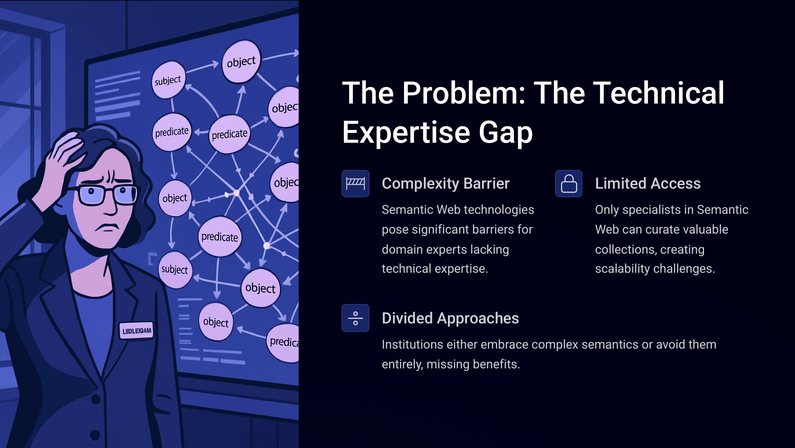
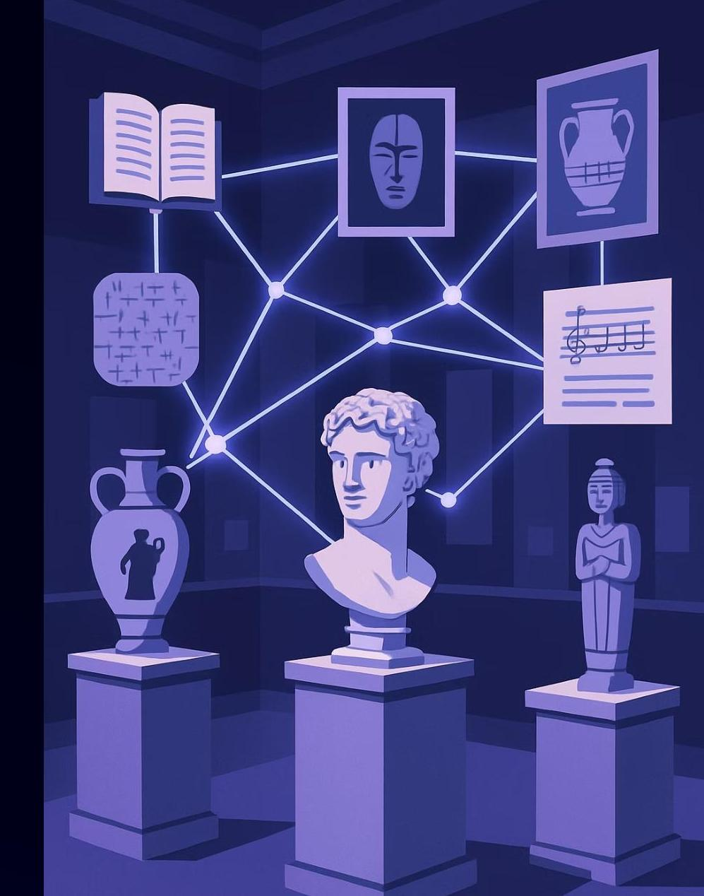
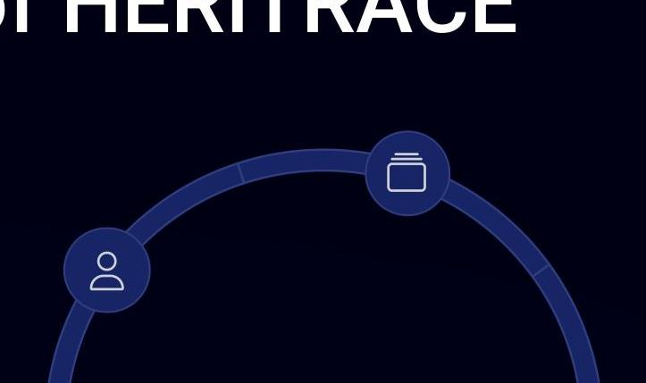
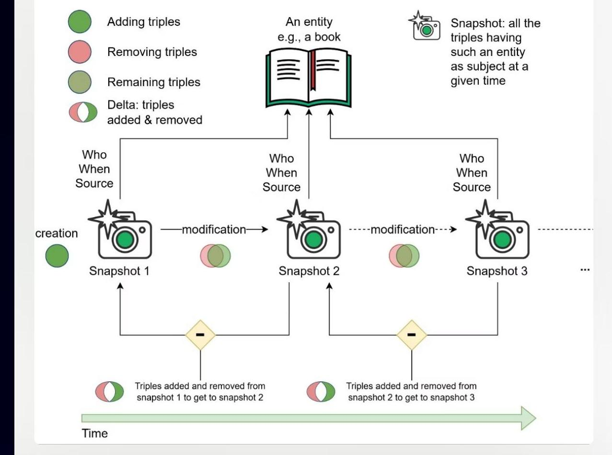
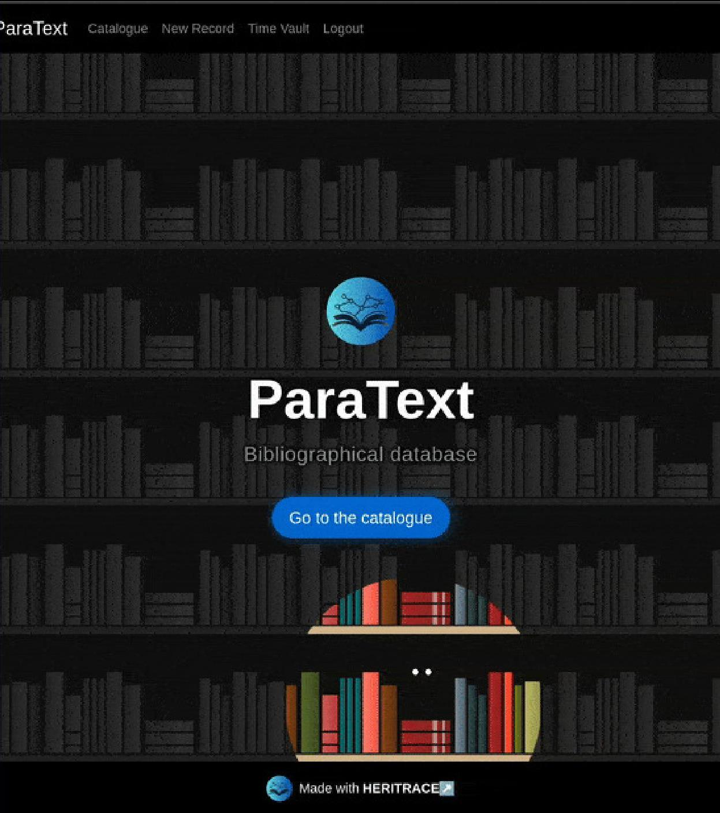

# HERITRACE: A User-Friendly Semantic Data Editor with Change Tracking and Provenance Management for Cultural Heritage Institutions 

Arcangelo Massari University of Bologna arcangelo.massari@unibo.it

# Today's Agenda 

The Challenge
Bridging semantic technologies with domain expertise

HERITRACE Solution
Key features and architecture

System Demonstration
Interface and functionality overview

Future Directions
Development roadmap and applications

# Semantic Web in Cultural Heritage: A Growing Trend 

Major cultural heritage institutions around the world are increasingly adopting Linked Open Data technologies to connect and share their collections.

- British National Bibliography (UK)
- Europeana (EU)
- Library of Congress (USA)
- Österreichische Nationalbibliothek (Austria)
- Koninklijke (Netherlands)
- Kansalliskirjasto (Finland)
- ARCo (Italy)
- Bibliothèque nationale de France
- Bibliothèque nationale du Luxembourg
- Biblioteca Nacional de España
- Biblioteca Virtual Miguel de Cervantes (Spain)
- Deutsche National Bibliothek (Germany)

# Current Limitations in Existing Tools 

| Platform | User-Friendly | Provenance   Mgmt. | Change   Tracking | Customization | Heterogeneous data sources |
| :--: | :--: | :--: | :--: | :--: | :--: |
| OmekaS | Yes | No | No | Limited | No |
| Semantic   MediaWiki | Partial | Yes | Via Plugins | Yes | No |
| Research Space | Yes | Yes | No | Complex | Yes |
| CLEF | Yes | Yes | Partial | No | No |

# Introducing HERITRACE 

Heritage Enhanced Repository Interface

HERITRACE is a web-based tool designed to bridge the gap between complex semantic technologies and domain expertise.

For Cultural Heritage Professionals
Enables non-technical experts to manage semantic data intuitively while preserving its integrity and richness.

# Core Objectives of HERITRACE 

## User-Friendly Interface

Intuitive design for non-technical domain experts

## Seamless Integration

Works with existing RDF data collections

## Provenance Management

Complete documentation of metadata changes

## Change Tracking

Robust reconstruction of previous data states

Flexible Customization
Adaptation through standard languages

# The User Interface: Catalog View 

## Categories Panel

Lists all available types of objects with count indicators. Provides easy navigation between content types.

## Item Listings

Displays content belonging to selected category with pagination controls. Shows key information at a glance.

## Sorting Controls

Allows users to organize items by different properties. Adjustable items per page for better viewing experience.

## Catalogue

## Items in category: Article

| Article | 87 |
| :--: | :--: |
| Article in Book | 9 |
| Issue | 40 |
| Journal | 42 |
| Journal Article | 117 |
| Miscellany | 14 |
| Monograph | 50 |
| Proceedings | 15 |
| Proceedings Paper | 24 |
| Review Article | 2 |
| Thesis | 1 |
| Volume | 98 |

## Items in category: Article

Sort by: Title
Items per page: 50
$\checkmark$
$\square$
$\square$
$\square$

Höschele, R.. A garland of freshly grown flowers. The poetics of editing in Philip's Stephanos. In: Greek epigram from the Hellenistic to the early Byzantine era.

Montana, F.. Editing anonymous voices: the scholia vetera to the Iliad. In: Sicut dicit. Editing ancient and medieval commentaries on authoritative texts.

Pagani, L.. Papyrus commentaries on the Iliad. In: Sicut dicit. Editing ancient and medieval commentaries on authoritative texts.

Aristofane e la religione negli scholia vetera alle Rane. In: Interpretazioni antiche di Aristofane.

Montana, F.. L'esegesi ad Aristofane su papiro. In: Interpretazioni antiche di Aristofane.

## The User Interface: Resource View

## I

## Inline Editing

Direct modification of metadata fields

## Real-time Validation

Immediate feedback on data entry

## Automatic Disambiguation

Searches existing entities based on completed fields to prevent duplicates

Bastianini, G. \& Haslam, M. \& Römer, C. (2005). Commentaria et lexica Graeca in papyris reperta (CLGP). 1, Commentaria et lexica in auctores. 1, AeschinesBacchylides. 1, Aeschines-Alcaeus. (Ed.). Saur.

Type
Monograph 2
expression 3

## Identifier

isbn:9783598730436
$\square$ VISR
doi:10.1515/9783110956191
$\square$ VISR

Title
Commentaria et lexica Graeca in papyris reperta (CLGP). 1, Commentaria et lexica in auctores. 1, Aeschines-Bacchylides. 1, Aeschines-Alcaeus.

## Time Machine:

## Preserving Data History

## Automatic Snapshots

Created whenever an entity is modified

## Provenance Metadata

Captures timestamps, agents, and sources

Version Comparison
View differences between snapshots

## One-Click Restoration

Return to any previous version

Bastianini, G. \& Haslam, M. \& Römer, C. \& Maehler, H. (2006). Commentaria et lexica Graeca in papyris reperta (CLGP). 1, Commentaria et lexica in auctores. 1, Aeschines-Bacchylides. 1, Aeschines-Alcaeus. (Ed.). Saur.
$\checkmark$ Edit Resource $\square$ Delete Resource $\square$ Time Machine

Type
expression 2
Monograph 3

Identifier
Isbn:9783598730436
$\square$ visit
doi:10.1515/9783110956191
$\square$ visit

Title
Commentaria et lexica Graeca in papyris reperta (CLGP). 1, Commentaria et lexica in auctores. 1, Aeschines-Bacchylides. 1, Aeschines-Alcaeus

Description

# Time Vault: Never Lose Your Data 

## Specialized Recycle Bin

Dedicated catalog for deleted entities. Items disappear from main catalog but remain accessible here.

- Deletion timestamp
- Responsible agent
- Associated modifications

## Simple Recovery

Quick access to deleted resources. Easy restoration process with single-click functionality.

- Preview deleted content
- Restore to active catalog
- Maintain all relationships

# Creating New Records 

## Select Entity Type

Choose from available entity types like Article, Book, or Artifact. Interface adapts to show relevant fields.

## Add Metadata

Fill in fields with validation support. System guides users with appropriate field types and constraints.

## Resolve Duplicates

Disambiguation system suggests existing entities. Prevents accidental duplication of resources.

## Deselote

Type
identifier

Identifier Scheme

## 

## Deselote

Family Name

Shotton

# Provenance Management and Change-Tracking 

- Provenance in HERITRACE: Metadata documenting when, who, what, and source of modifications
- Provenance Management Goal: Ensuring transparent, auditable history of curatorial actions
- Implementation with OCDM:
- Leverages OpenCitations Data Model
- Extends PROV Ontology for enhanced tracking
- Uses snapshots to capture entity states at specific moments
- Change-Tracking Approach:
- Employs SPARQL Deltas in document-based tracking
- Stores only differences between snapshots
- Minimizes storage needs while enabling efficient version reconstruction

# Powerful Customization Options 

## SHACL Constraints

Define data models and validation rules.

- Property definitions
- Cardinality constraints
- Value type validation
- Regular expression patterns

## YAML Configuration

Control visual presentation without coding.

- Display names
- Field visibility rules
- Search behavior
- Custom SPARQL queries

# Real-World Applications 

ParaText: Managing bibliographic metadata for textual resources at the University of Bologna

OpenCitations: Planned integration for bibliographic and citation data management

# Future Development Roadmap 

$\square$

RDF Mapping Language (RML) Integration

Enhanced compatibility with non-RDF data formats like CSV and relational databases

## $\Delta$

Usability Testing
Task-based testing with 15-20 GLAM professionals using both think-aloud protocols and quantitative testing methods

## $\square$

## Community Expansion

Broader adoption within GLAM institutions and collaborative improvement

# Get Involved with HERITRACE 

## Open Source Project

Available on GitHub and Software Heritage. Visit
github.com/opencitations/heritra
ce.

## Documentation

Comprehensive guides for both users and administrators.
Technical specifications available.

## Research Paper

Read our paper submitted to Umanistica Digitale (currently under peer review): https://doi.org/10.48550/arXiv.2501.16197

Contact Us
Reach out to Arcangelo Massari (arcangelo.massari@unibo.it)