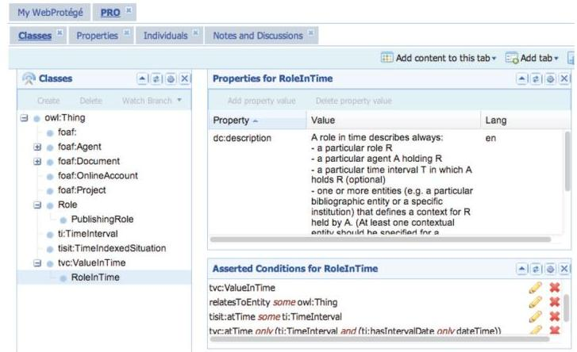

# Tools for the Automatic Generation of Ontology Documentation: A Task-Based Evaluation 

Silvio Peroni, Department of Computer Science and Engineering, University of Bologna, Bologna, Italy David Shotton, Department of Zoology, University of Oxford, Oxford, UK Fabio Vitali, Department of Computer Science and Engineering, University of Bologna, Bologna, Italy

#### Abstract

Ontologies are knowledge constructs essential for creation of the Web of Data. Good documentation is required to permit people to understand ontologies and thus employ them correctly, but this is costly to create by tradition authorship methods, and is thus inefficient to create in this way until an ontology has matured into a stable structure. The authors describe three tools, LODE, Parrot and the OWLDoc-based Ontology Browser, that can be used automatically to create documentation from a well-formed OWL ontology at any stage of its development. They contrast their properties and then report on the authors' evaluation of their effectiveness and usability, determined by two task-based user testing sessions.

Keywords: Live OWL Documentation Environment, Online Tools, Ontology, Ontology Browser, Ontology Documentation, Parrot, Task-Based Comparison, Usability Analysis, User Testing, Web Ontology Language (OWL), Webprotégé

## INTRODUCTION

Interaction with semantic data is one of the most important and challenging aspects of the Semantic Web. The creation and sharing of machine-readable semantic data has characterised the Semantic Web research since its beginning. However, making such semantic
information accessible to humans, from Semantic Web practitioners to non-expert users, is the key to integrating the Semantic Web with the everyday Web. To support users when working with semantic data, novel applications have been developed that hide the intrinsic complexity of the formalisms and languages used to define those data behind user-friendly interfaces. Such

tools require appropriate testing, to determine their effectiveness in supporting users in this way. This paper reports the results of usability testing sessions and task-based comparisons of tools commonly employed for ontology documentation and navigation.

A large number of established ontologies, especially those used in the Linked Data world, have good comprehensive Web pages describing their theoretical backgrounds and the features of their developed entities. However, problems arise when we look at ontologies under development, since natural language documentation is usually only published once an ontology has become stable. This approach is justifiable: writing proper documentation in the traditional way costs effort, and re-writing it every time a developing ontology is modified is not practical.

Thus, previously, the only way to gain an understanding of an ontology under development was to open it in an ontology editor so as to explore its logical axioms. This approach presents practical and cognitive barriers to a person approaching the ontology world for the very first time. First, (s)he has to download and install an ontology editor. Second, (s)he must learn to use the editor, which typically will have a complex and non-intuitive user interface. Third, (s)he will have to master the meaning of novel technical terms such as "axiom" and "refactor", or of common English words used in novel ways, e.g. "individual" or "functional". Then and only then can (s)he tries to get a sense of the structure of the ontology itself. Obviously these processes are challenging and time-consuming, presenting a barrier that is too great for the majority of non-specialists.

It is for this reason that tools for the automatic online generation of HTML documentation from ontologies are so critically important. Not only do they ease the task of creating effective ontology documentation, but they do so earlier in the creation life-cycle.

Besides automatically producing HTML documentation pages from ontologies, these tools can also be considered as ontology visualisation and browsing tools, since they enable interactive exploration of the ontology by the use of hyperlinks and/or Javascript mechanisms.

Such visualisation increases the understandability and potential usability of ontologies, both by experts and by people who are not expert in semantic formalisms and languages such as OWL and RDF.

In this paper we compare the nature and usability of some tools for the automatic live generation of human-readable documentation from ontology sources, in particular $\operatorname{LODE}^{1}$ (Peroni, Shotton, \& Vitali, 2012b), Parrot ${ }^{2}$ (Tejo-Alonso, Berrueta, Polo \& Fernandez, 2011), and Ontology Browser ${ }^{3}$ as web services that generate human-readable documentation in HTML of OWL ontologies (or more generally RDF vocabularies), as well as WebProtégé(Tudorache, Nyulas, Noy \& Musen, 2010), and the Manchester Syntax (a text-based linearisation of OWL ontologies) (Horridge \& Patel-Schneider, 2009), which although not specifically developed for documentation browsing, provide features that aid in the tasks of understanding ontologies. This paper presents extensions to and comparisons with the results obtained evaluating LODE on its own, presented in Peroni et al. (2012). In particular, while in Peroni et al. (2012) we focus on describing LODE as a service and provide a first usability evaluation of the tool, in this paper we describe additional evaluations that involve two new user testing sessions made in comparison with other similar tools (i.e. Parrot, the Ontology Browser and WebProtégé), so as to produce a more general evaluation of tools and services for the documentation and navigation of ontologies.

The rest of the paper is structured as follows. In Section "Tools for the documentation and navigation of ontologies", we introduce the main characteristics of LODE, Parrot, Ontology Browser and WebProtégé, and discuss related works. In Section "Tests" and Section "Second test" we describe the test-user experiments we ran to assess their completeness and usability and we provide an evaluation of their outcomes. In Section "Usability analysis" we analyse and discuss the outcomes of the usability findings of the tools used in the tests. Finally, in Section "Conclusions", we conclude the paper by sketching out the future developments of our work.

## TOOLS FOR THE DOCUMENTATION AND NAVIGATION OF ONTOLOGIES

The production of natural language documentation for ontologies is a crucially important part of any ontology development process. Such documentation enable users to comprehend the purpose and extent of an ontology without having to concern themselves with the particular formal language used to define its axioms. At the same time, human authorship of such documentation is an activity that involves a significant effort. Thus, in order to help authors of ontologies to document them, applications have been developed for the automated creation of such documentation using the labels (i.e. $r d f s$ :label), comments (i.e. $r d f s$ :comment), and other annotations (e.g. $d c$ :description, $d c$ :creator, $d c$ :date (Dublin Core Metadata Initiative, 2010; Dublin Core Metadata Initiative, 2010)) within the ontology, and using the logical structure of the ontology itself.

We can classify the tools identified according to some features that tools for browsing and making sense of ontologies through their documentation should have. Taking into account previous works on classification of ontologyenhanced systems such as (Paulheim \& Probst, 2010), for our study we consider the following characteristics:

- Structure: The number of separate views (i.e. a single page or multiple pages) used to represent the entities of the ontology.
- Style: Which presentation devices - i.e. lists, graphics, entity diagrams, verbose narrative or actual source code - are used to present the entities of the ontology.
- Interaction: Which interaction features - such as view or edit - are provided to the users.
- Imports: Whether the tool provides documentation about the additional ontologies that the displayed one imports.
- TBox: How much of the axioms of the TBox are presented - i.e. fully displayed,
partially displayed (e.g. when restrictions are missed) or none.
- ABox: How much of the axioms of the ABox are presented - i.e. fully displayed, partially displayed (e.g. when type axioms and assertions for individuals are missed) or none.
- Reasoner: Whether the tool presents axioms inferred by a reasoner rather than explicitly contained in the ontology.
- Multiple Ontologies: Whether the tool can display multiple ontologies within the same session.
- Cool URIs: Whether "cool URIs" (Sauermann \& Cyganiak, 2008) are used to access the tool on the Web. Of course this feature does not apply to tools not available online.
- Search: Whether the tool can find entities through textual search facilities.
- Query: Whether the tool can find entities using query languages such as SPARQL (Harris \& Seaborne, 2012), DL query ${ }^{4}$ or Terp (Sirin, Bulka \& Smith, 2010)).
- Languages: Whether the tool provides a choice of human languages to present the annotations of the ontology.
- Location: The particular physical location - local machine, web, embedded within the tool - where the ontology being presented is stored.

In Table 1 we classify all the tools introduced in this section according to the above characteristics. In addition, in the following four sub-sections, we show how the four online tools used in our experiments, namely LODE, Parrot, OWLDoc-based Ontology Browser and WebProtégé, organise the documentation of an example ontology, in our case PRO, the Publishing Roles Ontology ${ }^{5}$ (Peroni, Shotton \& Vitali, 2012a). Finally, in the last subsection, we discuss related tools in the area of ontology documentation, visualisation and navigation that have not been used in the experiments described in Section "Tests", mostly because these tools lack some of the crucial functionalities we need in a live ontology documentation tool

Table 1. The main features of several ontology documentation and ontology development tools

| Feature | LODE | Parrot | Ontology   Browser | WebProtégé | Paget | SpecGen | VocDoc | Neologism | NeOn   Toolkit | Protégé |
| :-- | :-- | :-- | :-- | :-- | :-- | :-- | :-- | :-- | :-- | :-- |
| Structure | single | single | multiple | multiple | single | single | single | single | multiple | multiple |
| Style | lists,   graph-   ics,   ver-   bose,   source   code | lists,   verbose | lists,   entity   diagrams,   source   code | lists, entity   diagrams,   source code | lists,   verbose | lists,   verbose | lists,   graph-   ics,   verbose | lists,   graphics,   entity   diagrams,   verbose | lists,   graph-   ics, en-   tity dia-   grams,   source   code | lists,   graphics,   entity di-   agrams,   source   code |
| Interac-   tion | view | view | view | view, edit | view | view | view | view, edit | view,   edit | vewi,edit |
| Imports | yes | no | yes | yes | no | no | no | yes | yes | yes |
| Reasoner | yes | no | yes | no | no | no | no | no | yes | yes |
| Multiple   ontolo-   gies | no | yes | yes | yes | no | no | no | no | yes | yes |
| TBox | fully   dis-   played | partially   dis-   played | fully displayed | fully displayed | partially   displayed | partially   displayed | partially   dis-   played | partially   displayed | fully   dis-   played | fully dis-   played |
| ABox | fully   dis-   played | partially   dis-   played | fully displayed | fully displayed | none | none | none | none | fully   dis-   played | fully dis-   played |
| Cool URIs | yes | no | no | no | N/A | N/A | N/A | yes | N/A | N/A |
| Search | no | no | yes | yes | no | no | no | no | yes | yes |
| Query | no | no | yes | no | no | no | no | no | yes | yes |
| Lan-   guages | yes | yes | no | no | no | no | no | no | no | no |
| Location | web,   local   ma-   chine | web,   local   machine | web | embedded | embed-   ded | embed-   ded | embed-   ded | embedded | embed-   ded,   web,   local   machine | embed-   ded, web,   local   machine |

(e.g. the ability to display ABox of ontologies or the fact that the tool can be used directly on the Web).

## The Live OWL Documentation Environment

LODE, the Live OWL Documentation Environment(Peroni et al., 2012b), is an XSLT-powered on-line service that automatically generates a human-readable description of an OWL ontology (or, more generally, an RDF vocabulary), taking into account both ontological axioms and annotations, and presents these with the appearance and functionality of a W3C Recommendations document.

LODE automatically extracts classes, object properties, data properties, named individuals, annotation properties, meta-modelling (punning), general axioms, SWRL rules and namespace declarations from any OWL or OWL 2 ontology, and renders them as ordered lists, together with their textual and graphical definitions, in a single human-readable HTML page designed for easy browsing and navigation by means of embedded links. A fuller description of LODE, and instructions about how to use its options, and how to set up content negotiation to deliver either a LODE representation of an ontology or the ontology OWL file itself, are given in Peroni et al. (2012b).

As shown in Figure 1, the header of the LODE page displays the name of the ontology and its descriptive metadata (date of publication, creators, imported ontologies, etc.). A brief abstract generated from rdfs:comment annotations follows the header, and a table of content then presents the various sections of the documentation that follow. In addition to the abstract, a further introductory section immediately follows the table of content, where descriptions (i.e. $d c$ :description annotations) of the ontology are displayed.

The following ontology entities are rendered in panels that all have more or less the same structure. For instance, for the classes role (http://purl.org/spar/pro/Role) and role in time (http://purl.org/spar/pro/RoleInTime) shown in Figure 2, the label of the entity is first rendered as the box header, accompanied by a small superscript symbol signifying the entity type ( $c$ for class, $o p$ for object property, $d p$ for data property, $a p$ for annotation property, and $n i$ for named individual). Each panel header also contains two hyperlinks that take the user back either to the general table of contents or to the entity-specific table of contents. In the next section of the panel, the entity IRI and a brief definition of the entity is given (generated from
rdfs:comment annotations). Then the entityrelated axioms are presented in human-readable form using the Manchester Syntax notation (Horridge \& Patel-Schneider, 2009). Finally, any additional descriptions (i.e. $d c$ :description annotations) are placed after the axiom subsection.

LODE is currently used by the following projects to document their ontologies:

- The SPAR (Semantic Publishing and Referencing) project ${ }^{6}$, to generate the documentation for the entire set of SPAR (Semantic Publishing and Referencing) ontologies (available at http://purl.org/spar), created to describe the publishing domain.
- The VIVO project ${ }^{7}$, an interdisciplinary network enabling collaboration and discovery among scientists across all disciplines, using an open source Semantic Web application originally developed and implemented at the Cornell University. VIVO uses an ontology for internal data representation and for data sharing on the Web, documentation for which ${ }^{8}$ is generated using LODE.

Figure 1. The incipit of the documentation of PRO, the Publishing Roles Ontology, generated by LODE

[^0]
[^0]:    Copyright (C) 2013, IGI Global. Copying or distributing in print or electronic forms without written permission of IGI Global is prohibited.

Figure 2. The rendering of the PRO classes role and role in time in LODE.

In addition, LODE has been listed in the Lower Level Design Tools page ${ }^{9}$ of the official W3C Semantic Web wiki under the category OWL ontology browsers, and has been used in the documentation of Provenance Ontology $(P R O V-O)^{10}$ by the W3C Provenance Working Group ${ }^{11}$.

## Parrot

Parrot ${ }^{12}$ (Tejo-Alonso et al., 2011) is a Web service for the generation of HTML+Javascript documentation of OWL ontologies and RIF rules (Boley et al., 2010). This service allows one to specify multiple URLs identifying ontologies in order to produce an HTML summary of them "on the fly", built from their logical structure and annotations.

Unlike LODE, which first displays ontology metadata and a description of the ontology, Parrot produced documentation in which the name of the ontology is immediately followed by an extended table of content introducing the entities comprising the ontology, as shown in Figure 3. Entity-specific tables of content and panels containing entity descriptions (derived from the ontologies ${ }^{13}$ ) follow the general table of content. The textual content of those descriptions are derived from the $d c$ description
and $r d f s$ :comment annotations provided in the ontology.

Each entity panel is introduced by the label (i.e. rdfs:label) of the entity, preceded by a symbol in a diamond widget identifying its type ( $o$ for ontology, $c$ for class, $p$ for object/data/ annotation property and $i$ for individual), and followed by buttons that allow one to show/ hide metadata, definitions and usage of the entity. Importantly, as shown in Figure 4, Parrot renders only the $r d f s$ :subClassOf axioms, and does not document class restrictions.

Parrot is currently used by the following projects for the production of documentation from OWL and RDF(S) ontologies:

- The Public Contracts Ontology that serves to express structured data about public contracts in RDF. It has been developed by the Czech OpenData initiative ${ }^{14}$;
- The ENVISION project ${ }^{15}$ to generate the documentation for the entire set of WSML (Web Service Modelling Language) ontologies (available at http://code.google.com/p/ wsmls/), created to describe the various topics relevant for the environmental domain.

In addition, Parrot has been also released as an Eclipse plugin ${ }^{16}$.

Figure 3. The incipit of the documentation of PRO, the Publishing Roles Ontology, generated by Parrot

## OWLDoc Web Ontology Browser

The Ontology Browser is an online documentation service based on $O W L D o c^{17}$ that automatically generates a set of HTML pages describing the target ontology. It organises the documentation of each ontological entity in different sections, showing the taxonomy of each entity,
its usage in the ontology, and its formal logical axioms expressed in Manchester Syntax (Horridge \& Patel-Schneider, 2009). Like Parrot, it can cope with more than one ontology at a time. In contrast to LODE and Parrot, the Ontology Browser renders the entities in a way that is more suited to ontology navigation than to the construction of documents for linear reading.

Figure 4. The rendering of the PRO classes role and role in time in Parrot

As shown in Figure 5, the "homepage" of the documentation is made up of distinct areas. On the top there is a set of tabs enabling different aspects of the ontology to be revealed: ontologies, classes, object properties, data properties, etc., together with a search panel. On the left, there is a tree representation of the entities selected (in this case, ontologies). Finally, on the right there is a large panel (labelled Annotations) containing the annotations of the selected entities, and below that two other panels: the first labelled References containing a summary of the ontology entities, and the second labelled Imports listing all the imported ontologies.

Clicking on a particular class from the list of all classes, for instance the PRO class role, results in the display changing to present information relevant to this new entity, as shown in Figure 6. Below the Annotations panel are now new boxes, labelled Superclasses, Members
and Usage, containing, respectively, details of the entity's taxonomical relationships (superclasses and equivalent classes), the individuals belonging to that class and, finally, the general usage of the class. If an object property is selected, other panels appropriate for such an entity are presented, listing, for example, the domain and range classes of the property. Thus, in the Ontology Browser, each selected entity of the ontology is associated with specific display panels depending on its type.

Each class is rendered as separate HTML page. Clicking on the PRO class role in time (shown in Figure 7) completely changes the text available in the class-specific panels displayed in the browser window, hiding the description of the previously-selected entity.

Figure 5. The incipit of the documentation of PRO, the Publishing Roles Ontology, generated by the Ontology Browser

Copyright (C) 2013, IGI Global. Copying or distributing in print or electronic forms without written permission of IGI Global is prohibited.

Figure 6. The rendering of the PRO class role in the Ontology Browser

## WebProtégé

WebProtégé (Tudorache et al., 2010) is a collaborative Web-based platform based on Protégé (Knublauch et al., 2005), a well-known environment for ontology development. Differently than the tools introduced so far, that were developed specifically for the generation and browsing of ontology documentation, WebProtégé mainly supports editing of ontologies and knowledge acquisition.

Yet, as any other ontology development tool, WebProtégé supports the creation and visualisation of documenting annotations that are shown in the box "Properties for [entity $X$ ]" illustrated in Figure 8 on the right hand-side of the window. In WebProtégé, the first visualisation of an ontology illustrates the classes (tab "Classes" and the tree-based navigation interface shown in the panel "Classes") and preselects the more abstract class (owl:Thing) by default. No information about owl:Thing are shown in Figure 8 since there are no annotations or assertions involving that class in PRO. All the properties and individuals of the ontology can be browsed clicking on the appropriate tab ("Properties" and "Individuals") placed on the right of the tab "Classes".

A click on one of the tabs on the top of Figure 8 results in changing the current view of the applications (e.g. a click on "My WebProtégé" will result in showing all the ontologies loaded by the system, while a click on the tab "Properties" will substitute the various panels shown by the application with those that are appropriate to show/edit properties axioms. Any click on items of contextual panels will result in change partially or totally the current view. For instance, clicking on the class role in the panel "Classes" will result in loading the appropriate "Property for..." and "Asserted Condition for..." panels for that class, as shown in Figure 9.

Similarly to the Ontology Browser, in WebProtégé each class is rendered as a new view of the system. For instance, clicking on the PRO class role in time (shown in Figure 10) completely changes the content of the panels shown in the current view, hiding the description of any previously-selected entity.

## Other Tools for Ontology Documentation and Navigation

In addition to the online tools described in the previous section, other tools have been developed the same purpose. Contrarily to the previous tools, which have been developed quite

Figure 7. The rendering of the PRO class role in time in the Ontology Browser

exclusively for the automatic or semi-automatic production of documentation, ontology editors can be used to present some sort of documentation, in particular annotations. In the long list of tools of these kinds, we need to cite at least the NeOnToolkit (Suárez-Figueroa, Gómez-Pérez, Motta \& Gangemi, 2012) and Protégé (Knublauch et al., 2005). In addition to visualising ontology annotations in appropriate panels, both make available tools for the visualisation and
interactive browsing of ontologies, e.g. KC-Viz (Motta et al., 2011) (based on the Key Concepts Extraction algorithm (Peroni, Motta \& d'Aquin, 2008) that enable the navigation of an ontology starting from the most important concepts) and OWLViz (Knublauch et al., 2005).

SpecGen ${ }^{18}$ is a Python tool for the generation of ontology specifications, available as a standalone application. It has been used to prepare the HTML documentation of well-known

Figure 8. The initial visualisation of PRO, the Publishing Roles Ontology, using WebProtégé

Copyright © 2013, IGI Global. Copying or distributing in print or electronic forms without written permission of IGI Global is prohibited.

Figure 9. The rendering of the PRO class role in WebProtégé

ontologies such as SIOC ${ }^{19}$. SpecGen generates the documentation by processing a pre-defined HTML template into which it adds the list of ontological classes and properties in specific positions. As a result, we obtain a new HTML document in which the natural language description of the ontology comes entirely from the template made by authors, while the software takes care of adding the specific information related to the logical structure of the ontology.

In contrast to SpecGen, that needs its base HTML template to work, $\operatorname{Voc} D o c^{20}$ is a small Ruby script that allows one to produce
documentation starting simply from an RDFS vocabulary or an OWL ontology. It is able to produce both HTML documents and LaTeX files containing the description of the vocabulary/ ontology.

Oriented to Linked Data applications rather than to ontology documentation, Paget ${ }^{21}$ is a PHP framework that, upon receipt of an input URL through a browser, dispatches the request according to the particular mime-type specified by the client, and can be used to display RDF entities in four different formats: RDF/XML, HTML, Turtle and JSON. It can also be used to

Figure 10. The rendering of the PRO class role in time in WebProtégé

[^0]
[^0]:    Copyright (C) 2013, IGI Global. Copying or distributing in print or electronic forms without written permission of IGI Global is prohibited.

describe a set of pure RDF statements (subject-predicate-object triples) ${ }^{22}$ and, to some extent, to produce an HTML human-comprehensible description from the axioms of an OWL ontology ${ }^{23}$.

Neologism ${ }^{24}$ (Basca, Corlosquet, Cyganiak, Fernández \& Schandl, 2008) is a Web-based editor for the creation of RDFS vocabularies and (very simple) OWL ontologies, and implements a publishing system that allows their publication on the Web, rendered into natural language HTML pages. Neologism main purpose is to reduce the time needed to create, publish and modify vocabularies for the Semantic Web.

## TESTS

We carried out two different tests to assess the efficiency, effectiveness and user satisfaction of documentation tools to understand ontologies. Two were the fundamental requirements for a system to be considered for the tests:

- Be Available Online And Accessible Through A Browser;
- Handle Correctly (Or At Least For The Purpose Of The Tasks To Perform) Both The Tbox And The Abox Of The Submitted Ontologies.

We identified four different systems that satisfy the aforementioned constraints: LODE, Parrot and the Ontology Browser as ontology documentation tool, as well as WebProtégé, a web-based ontology development tool.

In the first test they were evaluated against each other to determine relative strengths and weaknesses. Although the results gave us some interesting comparative results, on suggestion of an anonymous reviewer of an earlier draft of this paper we decided to run a second series of tests to provide definitive answers to two potential objections that could weaken our results, i.e. whether the size of the ontology could favour one tool against the others, and whether using an ontology documentation tool was in fact any help at all against accessing the source code of the ontology directly (the null hypothesis).

Thus the second test was carried out over three different ontologies (a small, a medium and a large one) and using one more "tool", namely a plain web browser showing the source of the ontology using the Manchester Syntax as its linearisation format (Horridge \& PatelSchneider, 2009). In the rest of this section we provide some details of the first test, and in section "Second test" we discuss the setup and results of the second test ${ }^{25}$.

## Test 1: Setup

With the objective of gathering feedback about the efficiency, effectiveness and user satisfaction of LODE, Parrot, the Ontology Browser and WebProtégé, we undertook task-based user evaluations. We asked twenty-four subjects, split in four groups of six (one group for each tool to be tested), to perform five tasks involving navigation through the ontology documentation produced by those tools, with an imposed time limit of ten minutes per task. A facilitator was present in all the tests, observing the subjects while they were undertaking their tasks and keeping time, but providing no assistance.

All the subjects were volunteers who had responded to personal e-mail invitations to participate. They were ontology engineers, as well as Semantic Web practitioners and computerliterate non-experts. The four groups had been organized a priori by balancing the skills of the participants in each group, so as to have a similar number of experts, practitioners and non-experts in each group. The answers to the self-assessment questionnaire filled up by the participants show that between $33 \%$ and $42 \%$ of subjects considered themselves experts in knowledge representation, OWL and RDFS.

For the tasks of the test, we employed one medium-size ontology, $F a B i O$, the $F R B R$ aligned Bibliographic Ontology ${ }^{26}$ (Peroni \& Shotton, 2012), which contains 214 classes, 69 object properties, 45 data properties and 15 individuals. FaBiO was chosen because we expected most people involved in the test to have familiarity with the domain it describes, namely bibliographic entities such as research papers, journal articles and books. In addition,

Table 2. The five tasks subjects performed in the user testing session of the first test

| Task A | Describe the main aim of the ontology. |
| :-- | :-- |
| Task B | Describe what the class doctoral thesis defines. |
| Task C | Describe what the object property has subject term describes, and provide a brief description of   its domain and range classes. |
| Task D | Record the class having the largest number of direct individuals (i.e. individuals that belongs   explicitly to that class and that are not inferable from its subclasses). |
| Task E | Record all the direct and indirect subclasses of the class item (IRI "http://purl.org/spar/fabio/Item")   and record the properties involving the class item or one of its subclasses either as domain or range. |

FaBiO was also chosen because a larger ontology requiring more time to complete the tasks, may had reduced the number of users willing to undertake the evaluation, while a smaller ontology would have presented insufficient navigational challenges.

The tasks given to the subjects are shown in Table 2. This set was designed to explore the effectiveness of the tools in creating humanreadable visualisation of ontology axioms and in providing efficient ontology browsing.

Task A is a pure descriptive activity that involves only the visualisation of the ontology proposed by the tools. Task B and C are similar to Task A, but in addition will typically require the user to use some navigational facilities to reach the class doctoral thesis and the object property has subject term. Finally, Task D and E further assess how easily the tools enables users to browse the ontology and understand its structure.

Our interest was to assess how well the tools help users by producing human-readable visualisation of an OWL ontology that was easy to browse and to make sense of.

The test session was structured as follows. The test users were first given a five minutes introductory talk on ontologies and OWL, since some were not familiar with these concepts. Then, they were asked to complete a short multiple-choice questionnaire about their background knowledge and skills in OWL, ontology engineering and ontology documentation (maximum time required for completion: two minutes). Then, separately for each of the four groups of six individuals, they were given
a quick demonstration lasting three minutes of the specific tool that group would be testing, using the relatively simple ontology $P R O$, the Publishing Roles Ontology ${ }^{27}$ (Peroni et al., 2012a), to highlight the most important features of the tool. They were then asked to spend five minutes to further explore the PRO ontology on their own, in order to become familiar with the structure of the documentation that their particular tool produced, and with its navigation mechanisms. Finally, as the real test, the subjects were asked to complete the five tasks listed in Table 2 using the documentation of the FaBiO ontology created by their assigned tool. They had a maximum of ten minutes to complete each task - if they were not able to solve a particular task within 10 minutes, their task was recorded as "failed". After the test, we asked subjects to spend five more minutes to complete two short post-questionnaires, one multiple choice and the other textual, reporting their experiences of using the tool to complete these tasks.

## Test 1: Efficacy

Of the 120 task attempts ( 5 tasks per person undertaken by a total of 24 subjects, in four groups of six people each, one group for each tool), 101 were completed successfully (i.e. the test users produced the right answer within the ten minute period allocated for each question), while 19 were not completed, giving an overall success rate of $84 \%$. In Table 3 we illustrate how many tasks were answered correctly by the users of the various tools.

Table 3. Correct answers to the five tasks of the first test (max: 6)

|  | LODE | Parrot | Ontology   Browser | WebProtégé | Total |
| :-- | :-- | :-- | :-- | :-- | :-- |
| Task A | 6 | 6 | 6 | 5 | 23 |
| Task B | 6 | 6 | 6 | 6 | 24 |
| Task C | 6 | 5 | 6 | 5 | 22 |
| Task D | 6 | 5 | 6 | 4 | 21 |
| Task E | 3 | 4 | 4 | 0 | 11 |
| Totals | 27 | 26 | 28 | 20 | 101 |

These results seemed to suggest a comparable efficacy of the pure ontology documentation tools (i.e. LODE, Parrot and the Ontology Browser), while WebProtégé seemed to be less successful to address the tasks. In particular, WebProtégé appears to be completely unsuccessful to address a complicated question such as the fifth task (no successful answers).

## Test 1: Efficiency

Table 4 shows the average time taken by each group of six subjects in completing each task, with "failed" attempts included in the average and arbitrarily scored at 10 minutes. As shown in the table, for tasks A to D the fastest average performance was with LODE, while in task E Parrot gave the best performance. The total time taken across the five tasks when using LODE was about four minutes faster than when using the Ontology Browser, and about fourteen minutes faster than when using Parrot. In particular, a Tukey HSD (Honestly Significant Difference (Tukey, 1953)) pairwise comparison performed on the total time spent by users to complete all the tasks ( $\mathrm{F}=10.98$, p-value $<0.01$, under the required conditions of homogeneity of variance) showed that the difference between LODE and Parrot was statistically significant ( $0.01<$ p-value $<0.05$ ), while the difference between WebProtégé and LODE and between WebProtégé and the Ontology Browser was highly significant (p-value $<0.01$ ).

In addition, a Tukey HSD pairwise comparison was also performed on the results of
each task. Because of the high variance in the times taken for the individual tasks, it produced significant results only for Task C under the required conditions of homogeneity of variance and significance of the ANOVA F value ( $\mathrm{F}=$ $3.86,0.01<$ p-value $<0.05$ ). In particular, the difference in completion times for Task C between LODE and Parrot was significant ( 0.01 $<$ p-value $<0.05$ ), while between LODE and WebProtégé was approaching the significance ( $0.05<$ p-value $<0.1$ ). Although mean performance across the first four tasks was faster for LODE, performance differences on the Tasks A, B and D did not reach statistical significance. Neither did they for Task E, in which Parrot showed the best performance.

Nevertheless these results suggest advantages for LODE in supporting users in understanding, browsing and making sense of (medium-size) ontologies through its documentation. It is reasonable to assume that increasing the sample size beyond the six subjects per group used in the current study would lead to statistical significance in the differences for overall performance and possibly also for other individual tasks.

## Test 1: Satisfaction

A common metrics of the satisfaction of users is the ratio between positive and negative words in the free text parts of questionnaires. A more systematic approach is grounded theory.

Grounded theory (Strauss \& Corbin, 1998) is a well-known method used in social science

Table 4. The average time in minutes:seconds (sd: Standard Deviation) to complete the five tasks of the first test

|  | LODE | Parrot | Ontology Browser | WebProtégé |
| :-- | :-- | :-- | :-- | :-- |
| Task A | $1: 13(\mathrm{sd}: 0: 45)$ | $5: 52(\mathrm{sd}: 3: 30)$ | $1: 41(\mathrm{sd}: 0: 57)$ | $8: 02(\mathrm{sd}: 2: 10)$ |
| Task B | $0: 40(\mathrm{sd}: 0: 15)$ | $2: 45(\mathrm{sd}: 0: 41)$ | $2: 03(\mathrm{sd}: 1: 52)$ | $2: 00(\mathrm{sd}: 0: 59)$ |
| Task C | $2: 39(\mathrm{sd}: 1: 01)$ | $6: 48(\mathrm{sd}: 2: 31)$ | $4: 16(\mathrm{sd}: 2: 15)$ | $5: 55(\mathrm{sd}: 2: 55)$ |
| Task D | $1: 30(\mathrm{sd}: 0: 46)$ | $5: 12(\mathrm{sd}: 2: 42)$ | $2: 49(\mathrm{sd}: 1: 24)$ | $8: 20(\mathrm{sd}: 2: 06)$ |
| Task E | $7: 09(\mathrm{sd}: 3: 10)$ | $6: 34(\mathrm{sd}: 2: 32)$ | $6: 46(\mathrm{sd}: 3: 14)$ | $10: 00(\mathrm{sd}: 0: 00)$ |
| Total | $13: 11(\mathrm{sd}: 4: 21)$ | $27: 11(\mathrm{sd}: 10: 30)$ | $17: 35(\mathrm{sd}: 6: 41)$ | $34: 02(\mathrm{sd}: 4: 52)$ |

to extract the most relevant concepts from unstructured collections of natural language resources such as texts, interviews, and questionnaires. In opposition to traditional methods aiming at fitting (and sometimes forcing) the content of the resources into a prefabricated model, grounded theory aims at having the model emerge "naturally" from the systematic collection, rephrasing, reorganization and interpretations of the actual sentences and terms of the resources. We thus thought it a reasonable tool to examine the final questionnaires of the test and have the most relevant concepts emerge from the text.

The textual questionnaire contained four identical questions, two asking for positive aspects, and two for negative aspects of the tested tool, and orthogonally two asking for qualifications (i.e., adjectives), and two for features and services (i.e., substantives) of the tool:

- How effectively did [tool X] support you in the previous tasks?
- What were the most useful features of [tool $X]$ to help you realise your tasks?
- What were the main weaknesses that [tool X] exhibited in supporting your tasks?
- Can you think of any additional features that would have helped you to accomplish your tasks?

All 24 subjects produced relevant content for the questions, some in English, and some in Italian. We manually converted Italian text into English taking care to lose as little as possible
in relevant content and nuances, and proceeded with open coding (extracting relevant sentences -i.e. codes - for the text) and axial coding (the rephrasing of the codes so as to have connections emerge from them and generate concepts), and analysed their frequency so as to let the most relevant concepts emerge.

Even though this analysis was performed separately for each tool, some concepts emerged that the tools shared. Since no subject was asked to use more than one tool, this commonality of topics may require some underlying analogies due to the domain, more than the individual features of the tools. Although it is not the place to provide a thorough discussion of the results obtained, it is worth mentioning some interesting results from this activity:

- All six subjects working on LODE, two who used the Ontology Browser and WebProtégé, and one using Parrot mentioned in some form or another the organization and structure of the information presented, although some in positive, and some in negative terms. This indicates that the users felt that this was the most relevant evaluation factor of the tool, and that some work remains to be done in that regard.
- Three subjects for LODE and three for Parrot mentioned lack of a search function as a serious problem: since they are both single-page tools, the lack of an in-page mechanism for searching for strings and the reliance only on the browser's search tool makes looking up strings a more compli-

cated task than it should be. All six subjects working on WebProtégé and one subject for the Ontology Browser, which are not a single-page tools, mentioned the search box (although some in positive, and some in negative terms), which gives strength to the idea that special tools for search need to be implemented even if the user does not have to navigate from page to page.

- More specific to the field of OWL and ontologies, the need to expose the relationships between entities was emphasised: both LODE, Parrot and WebProtégé received praises for the links connecting entities along the super-subclass axis, and for LODE also on the class-property axis, while Parrot and WebProtégé were criticized three and two times respectively for the lack of clarity in the relationships between individuals and their classes.
- Finally, although mentioned only once each, the following themes gathered wording strong enough to justify their mentioning here: bugs in the Ontology Browser, the lack of graphical views of the relationships in both LODE and Parrot, the lack of meaningful URI in the Ontology Browser, the lack of visualisation of natural language description of the ontology in WebProtégé, other problems in the interface, and in particular in scroll bars and lack of navigation control, in both LODE and Parrot.

## SECOND TEST

In order to gather additional data about the usability and the user-satisfaction of LODE, Parrot, the Ontology Browser and WebProtégé, we undertook a second user testing. Following a specific suggestion by an anonymous reviewer, we have strived to verify the relative performance of our four tools against the size of the ontology being documented, and to verify the null hypothesis, i.e. that these tools perform better than no tool at all.

## Test 2: Setup

We asked twenty-five subjects to perform nine unsupervised tasks (max. 5 minutes per task), involving ontology navigation using the aforementioned tools. Contrarily to the previous user testing session, testers did all their tests online from their offices, so there were no "facilitators" this time to observe the subjects carrying out their tasks or recording times. All the subjects-mainly Semantic Web experts and practitioners - were volunteers who responded to personal e-mail invitations. Note that there was an overlap between some users of the first and second tests. However, we guaranteed that users who had used a particular tool in the first test did not use the same tool in the second test. We divided the participants into five different groups of five people each. Four groups were given one of the aforementioned tools, while one group had to use only the Manchester Syntax linearisation (Horridge \& Patel-Schneider, 2009) to carry out the tasks. The answers to the self-assessment questionnaire that participants filled up shows that between $35 \%$ and $50 \%$ of subjects considered themselves experts in knowledge representation, OWL and RDFS.

For the tasks, we used three ontologies of fairly different sizes: a small one (the $A K T$ SupportOntology ${ }^{28}, 17$ classes, 5 object properties, 10 data properties and 13 individuals), a medium-sized one ( FaBiO , already used in the previous test, 214 classes, 69 object properties, 45 data properties and 15 individuals), and a large ontology (the Proton Ontology ${ }^{29}, 504$ classes, 132 object properties, 47 data properties and 68 individuals).

The tasks given to the subjects are shown in Table 5. Each subject had to perform three exploration tasks on each ontology, for a total of nine tasks to address. This set of tasks was designed to assess the capabilities of the tools involved in the test in making ontologies understandable to users.

Task A is a pure descriptive activity that involves only either the visualisation of the ontology proposed by the tools or its Manchester Syntax linearisation. Finally, Tasks B and

Table 5. The three tasks subjects performed with each of the three ontologies in the second test. Class $X$ corresponds to physical quantity for $A K T$ support ontology, concept for $F a B i O$ and social position for Proton.

| Task A | Describe the main aim of the ontology. |
| :-- | :-- |
| Task B | Record the class having the largest number of direct individuals (i.e. individuals that belongs explic-   itly to that class and that are not inferable from its subclasses) and describe what that class defines. |
| Task C | Record all the direct and indirect subclasses of the class $X$ and record the (object and data) proper-   ties involving the class $X$ or one of its subclasses either as domain or range. |

C further assess how easily the tool/linearisation in consideration enables users to browse the ontology and understand its structure. As in the previous test, our interest was to assess how well the tools and the Manchester Syntax linearisation help users by producing humanreadable visualisation of an OWL ontology that was easy to browse and make sense of.

The test session was structured as follows. We first asked subjects to complete a short multiple-choice questionnaire about their background knowledge and skills in OWL, ontology engineering and ontology documentation and ontology development environments (max. 2 minutes). Then, as a warm-up task, we asked subjects to use the proposed tool/linearisation to explore the FOAF ontology ${ }^{30}$, a relatively simple ontology, in order to become familiar with the structure of the presentation it produced and with its navigation mechanisms (max. 5 minutes). Then, as the real test, we asked subjects to complete the three tasks listed in Table 5 exploring the aforementioned three ontologies (i.e. AKT Support Ontology, FaBiO and Proton) through the tool/linearisation assigned (ideally 2 minutes, max. 5 minutes, per task). Finally, we asked subjects to fill in two short questionnaires, one multiple choice and the other textual, to report their experience of using the tool/linearisation to complete these tasks (max. 5 minutes).

## Test 2: Efficacy

Of the 225 task attempts ( 9 tasks per person undertaken by a total of 25 subjects, in five groups of five people each, one group for each
tool/linearisation format), 126 were completed successfully (i.e. the test users produced the right answer for each question), while 99 were not completed (i.e. the test users produced the wrong or partial answer to questions), giving an overall success rate of $56 \%$. In Table 6 we illustrate the number of correct answers users returned for each task.

The observed efficacy was quite different among the tools in this test. As for the quantitative outcomes of the first test (introduced in Section "Test 1: efficacy"), the pure ontology documentation tools (i.e. LODE, Parrot and the Ontology Browser) had a similar efficacy, with the exception of Task C where LODE appeared to be always more successful than the other tools. In addition, the efficacy of LODE seemed not to change drastically depending on the size of the ontology in consideration, with the only exception of Task C addressed on Proton, where LODE appeared less successful than when performing the same task on the other small-size and medium-size ontologies. Contrarily to that, both Parrot and the Ontology Browser had a clear decrease of performance for Task C depending on the size of the ontology in consideration.

For the remaining tool (i.e. WebProtégé) and the linearisation format (i.e. Manchester Syntax), the efficacy seemed to be extremely dependant on the size of the ontology, since the larger the ontology was the more users produced wrong answers for all the tasks. In addition, within the limits of the small sample size employed in this analysis, the efficacy when using WebProtégé was comparable with that when using the Manchester Syntax linearisa-

Table 6. The number of times users produced correct answers for each of the nine tasks, using their assigned tool/linearisation (maximum value: 5)

| Ontology | Task | LODE | Parrot | Ontology   Browser | WebProtégé | Manchester   Syntax | Totals |
| :-- | :-- | :-- | :-- | :-- | :-- | :-- | :-- |
| AKT Sup-   port | $A$ | 5 | 4 | 4 | 5 | 5 | 23 |
|  | $B$ | 2 | 2 | 2 | 4 | 3 | 13 |
|  | $C$ | 4 | 3 | 2 | 3 | 2 | 14 |
| FaBiO | $A$ | 5 | 4 | 5 | 3 | 5 | 22 |
|  | $B$ | 2 | 3 | 2 | 3 | 2 | 12 |
|  | $C$ | 4 | 2 | 1 | 0 | 1 | 8 |
| Proton | $A$ | 5 | 5 | 5 | 4 | 1 | 20 |
|  | $B$ | 3 | 2 | 3 | 0 | 2 | 10 |
|  | $C$ | 2 | 1 | 1 | 0 | 0 | 4 |
| Totals |  | 32 | 26 | 25 | 22 | 21 | 126 |

tion format (which allowed one to browse the ontology through the textual search feature of the browser).

## Test 2: Satisfaction

An analysis similar to the one discussed in Section "Test 1: satisfaction" was performed over the answers to the questionnaires of the second test. The questionnaires contained the same four identical questions already discussed previously.

All 23 out of 25 subjects produced relevant content for the questions, mostly in English, with a few Italian comments. We then proceeded with open coding (extracting relevant sentences - i.e. codes - for the text) and axial coding (the rephrasing of the codes so as to have connections emerge from them and generate concepts), and analysed their frequency so as to let more relevant concepts emerge, as in the first test.

In contrast to the first test, some clear trends appear in the evaluation of individual tools. For instance, the representation of individuals has been criticized by four people testing Parrot, while three out of five people made favourable comments about LODE with regards to the representations and navigation among the relationships of the entities of the ontology.

On the other hand, the fact that three out of five people made positive comments about the clarity of the plain text representation of the Manchester Syntax appear, in the context, more due to the desire of finding something even slightly positive about the experience than to a concrete appreciation of the "feature". In Table 7 we show the results of the axial coding of the comments, with the count of positive and negative mentions of each term (but only for those items that were mentioned at least twice).

Studying the table across tools, we notice not surprisingly that the presentation style, the richness of features, and the correct and meaningful representation of relationships between entities, are aspects that are often present, both in positive and negative aspects, while less intuitive is the strength of the opinions about the management of individuals (undoubtedly connected with the fact that individuals were the topics of one of the tasks).

## USABILITY ANALYSIS

The usability score for each tool was computed using the System Usability Scale (SUS) (Brooke, 1996), a well-known questionnaire used for testing people's perception of the usability of a system. It has the advantage of being technology

Table 7. Axial coding of the questionnaires of the second test, with frequency (only items mentioned 2 or more times)

|  | LODE |  | Parrot |  | Ontology   Browser |  | WebProtégé |  | Manchester   Syntax |  |
| :-- | :--: | :--: | :--: | :--: | :--: | :--: | :--: | :--: | :--: | :--: |
|  | + | - | + | - | + | - | + | - | + | - |
| representation of   relationships | 3 |  | 2 | 1 | 1 |  |  | 1 |  | 1 |
| presentation | 1 | 2 | 1 |  |  | 1 |  |  | 3 | 1 |
| counting features |  | 2 |  |  |  |  |  |  |  |  |
| use of labels |  | 2 |  |  |  |  |  |  |  |  |
| richness of features |  |  | 2 |  | 1 | 3 |  | 1 |  | 1 |
| tree view |  | 1 |  |  |  |  | 1 |  |  |  |
| search |  | 1 |  |  |  |  |  | 2 |  |  |
| individuals |  | 1 |  | 4 |  | 2 |  | 2 |  |  |
| bugs |  |  |  |  |  | 1 |  |  |  |  |
| getting used to |  |  |  |  |  | 2 |  | 1 |  |  |
| unfit for the task |  |  |  |  |  |  |  |  |  | 2 |
| indirect structures |  | 1 |  | 1 |  |  |  |  |  |  |

independent (it has been tested on hardware, software, Web sites, etc.), and it is reliable even with a very small sample size (Sauro, 2011). In addition to the main SUS scale, we also were interested in examining the sub-scales of pure Usability and pure Learnability of the system that have been recently proposed by Lewis and Sauro (2009).

The SUS scores have been calculated using answers of ten multiple-choice questions in the post-test questionnaires. As shown in Table 8, the mean SUS scores for the tools (out of a range between 0 and 100, 100 being the best) favour LODE (they are consistent with the results obtained testing LODE alone in a preliminary evaluation (Peroni et al., 2012b)), trailed by Parrot, while the Ontology Browser and WebProtégé fail to surpass the SUS target score of 68 required to demonstrate a good level of usability (Sauro, 2011). The mean values of the SUS sub-scales Usability and Learnability were respectively 72.7 and 80.7 (LODE), 66.2 and 77.3 (Parrot), 53.7 and 67.0 (Ontology Browser), and 48.0 and 60.2 (WebProtégé).

A Tukey HSD pairwise comparison was performed on each measure. According to the required conditions of homogeneity of variance and significance of the ANOVA F value, we obtain that:

- The difference of SUS values $(\mathrm{F}=7.07$, p -value $<0.01$ ) between LODE and webprotégé is highly significant (p-value $<$ 0.01 ), while the one between LODE and the Ontology Browser and between Parrot and webprotégé is statistically significant $(0.01<$ p-value $<0.05)$;
- The difference of Usability values $(\mathrm{F}=2.57$, $0.05<$ p-value $<0.1$ ) between LODE and webprotégé is approaching the statistical significance $(0.05<$ p-value $<0.1)$;
- The difference of the Learnability values ( F $=7.39$, p-value $<0.01$ ) between LODE and webprotégé is highly significant (p-value $<0.01$ ), while the one between LODE and the Ontology Browser and between Parrot and webprotégé is statistically significant $(0.01<$ p-value $<0.05)$.

Table 8. System Usability Scale values and related sub-measures for the four tested tools

| Measure | LODE | Parrot | Ontology Browser | WebProtégé |
| :-- | :-- | :-- | :-- | :-- |
| SUS value | 74.3 | 68.4 | 56.1 | 50.5 |
| Usability | 72.7 | 66.2 | 53.4 | 48.0 |
| Learnability | 80.7 | 77.3 | 67.0 | 60.2 |

In addition, we also calculated the SUS values of the Manchester Syntax linearisation used in the second test according to the five multiple-choice post-questionnaires filled up by subjects. Although the difference with the SUS scores of the other tools is not statistically significant, itturned out that the SUS score of the Manchester Syntax, which is just a linearisation format, was 52.0 (Usability 48.1, Learnability 67.5), thus slightly better that the SUS score of WebProtégé, which is a proper ontology development editor. This seems to be connected with the intrinsic ease of learning Manchester Syntax constructs in combination with the text search feature of the browser used to navigate the ontology in consideration. Still the overall SUS score for the Manchester Syntax is lower than the threshold of 68 , thus disproving the null hypothesis that using no tool is not worse than using one of the documentation tools.

In addition, two further "experience" subscores were calculated for each subject, by considering the values of the answers given in the background questionnaire of both the tests, composed of:

- in the first test, ten questions about the subject's prior experience with ontologies and two questions about his/her prior experience with ontology documentation tools;
- in the second test, twelve questions about the subject's prior experience with ontologies and three questions about his/her prior experience with ontology documentation and ontology engineering tools.

We compared these sub-scores (data not shown) with the partial SUS values and the other sub-scale values obtained from each test, using
the Pearson Correlation Coefficient (Pearson's $r)$. We found a statistically significant $(0.01<$ p-value $<0.05$ ) medium positive correlation $(\mathrm{r}=0.44)$ between the prior experience with ontology documentation tools sub-score and the SUS values of the first test. This shows that the perceived usability of the tools is greater among those who have previously used ontology documentation tools, which is perhaps not surprising.

## Discussion

The first thing to notice from the results presented here is that the Ontology Browser and WebProtégé have the worst SUS score (56.1 and 50.5 respectively), despite the fact that the former presented the smallest number of task failure ( 2 on Task E) in the first test. This result probably derives from the multiple-page organisation of ontological entities, which may be perceived as less usable while actually allowing people to work efficiently - probably because its navigation structure is similar to that found in ontology editors such as Protégé (Knublauch et al., 2005) and the NeOn Toolkit (Suárez-Figueroa et al., 2012). In particular, their presentation of entity/sub-entity relationships by means of an expandable/collapsible navigation tree was much appreciated by users.

Task E in the first test and Task C in the second one were the ones with the largest number of failures -7 out of $18(39 \%)$ for the former, 49 out of $75(65 \%)$ for the latter across all the tools used. There are two different causes for this result that varies depending on the test in consideration. First, in the first test the ontology confusingly contains two different classes labelled "item", the FaBiO class fabio:Item (http://purl.org/spar/fabio/Item)

- the subject of the test - and the FRBR class frbr:Item (http://purl.org/vocab/frbr/core\#Item) of which fabio:Item is a sub-class. Since some of the tools use labels (rdfs:label annotations) to name entities, and since these two classes have the same label "item", it is not immediately obvious which of these two classes should be studied to obtain the answer sought in Task E. In retrospect, it would have been wiser to have chosen a different class for the task (actually, we did so for Task C of the second test), one that lacked a similarly labelled superclass. However, that choice showed up crucial limits and issues of all the tools when dealing with similarly labelled entities.

Second, in both the tests we noticed that "expert" subjects, i.e. those having extensive skills in OWL and RDF, tended to ignore those aspects of some of the tools that differed from those with which they were already familiar from ontology editors. For instance, LODE, Parrot and the Ontology Browser presented all those properties having a particular class as their domain or range class directly in the documentation of that class. However, "expert" subjects tended to bypass this presentation of the required information: rather, they looked directly at the object property descriptions one by one, checking each property to see whether the class in consideration was used either as a domain or a range class. In addition to be timeconsuming, this activity actually increased the risk of mistakes, such as the being confused by the duplicate label problem introduced in the previous paragraph.

In Task C of the first test, we measured a significative difference between the performances recorded using LODE and Parrot. This seems to have been caused by the lack of the inclusion of descriptions of entities in the Parrot documentation when those were defined in imported ontologies, the class frbr:Endeavour being such a case. In this case, our Parrot test users were obliged to obtain a hasty description of those imported classes by looking for their subclasses displayed in the documentation.

Although we did not reach statistical significance here, in Task D of the first test we
observed a strong difference between Parrot, WebProtégé and the other tools in terms of their performances, with WebProtégé being slower. In Parrot, this may be caused by lack of other basic information in the documentation produced, in this case about individual members of a class. Parrot provides no text in the description of any individual referring to its asserted type(s), i.e. the class(es) to which the individual belongs. However, in WebProtégé the issue seemed to be caused by the problem of identify the classes that have individual associated.

Similarly, the slow performance using Parrot and WebProtégé in Task A of the first test may be due to the lack of ontology metadata in the Parrot-produced documentation and in the first visualisation provided by WebProtégé. In particular, starting the documentation with a complete table of content (Parrot) or with the hierarchical tree of classes (WebProtégé) instead of giving information about the ontology itself seemed to penalise both tools.

In addition, the second test (with ontologies of different sizes) revealed that some approaches, i.e. WebProtégé and the use of browsers' search facilities to navigate the Manchester Syntax linearisation of an ontology, were less effective than others to address the three tasks on large ontologies. Along the same line, the ways in which LODE, Parrot and the Ontology Browser represent relationships, which were very much appreciated as shown in Table 7, appeared to be an important advantage when browsing ontologies with several relationships.

Of course, with the small number of participants, we cannot rule out the fact that, despite our attempts to conduct fair tests by attempting to balance the skills of the participants between the groups, uneven distribution of skills between the groups in practice might have influenced the results.

## CONCLUSION

Ontologies are knowledge constructs essential for creation of the Semantic Web, the Web of linked data. In this paper, we have described

three tools, LODE, Parrot and the OWLDocbased Ontology Browser, that can be used automatically to create documentation from an OWL ontology at any stage of its development, we have contrasted their properties, and we have reported on our evaluation of their effectiveness and usability, determined by taskbased user testing.

The Ontology Browser is unique among the three in enabling the user to browse an ontology by means of separate expandable/collapsible hierarchical trees for classes, object properties, etc., of the sort familiar to users from use of file managers and ontology editors such as Protégé. However, since it presents information about individual ontology entities in separate windows, it makes it difficult to compare ontology entities and aggregate information involving several of them. Users judged it to have the poorest usability of the three tools, probably for this reason. Nevertheless, they took only a little longer to complete their ontology navigation and comprehension tasks when using the Ontology Browser that when using LODE, and they did so with fewest errors.

Parrot shares with the Ontology Browser the capability of being able to document more than one ontology at the same time, but presents the information in linear form, preceded by a hyperlinked table of contents. Its main drawback is that it fails to present all the entity-specific information within the ontology, specifically lacking display of the individual members of classes, of class restrictions, and of descriptions of entities defined in imported ontologies, and inadequate displaying basic descriptive information about the ontology itself. Perhaps for these reasons, users took twice as long to complete the test tasks when using Parrot as when using LODE, and had the greatest number of failures, yet Parrot shared with LODE the characteristic of having a good level of usability as reported by users using the standard System Usability Scale questionnaire.

LODE's disadvantages are that it can only be used to document one ontology at a time, and that it lacks a tree-like display. However, it presents all the information contained in the
ontology in an accessible manner, and scored highest of the three tools tested in terms of both usability and speed of test completion.

Although we already involved WebProtégé (i.e. a proper ontology development editor) in our tests, in the future we plan to conduct further user testing sessions, using a larger number of testers to strengthen the statistical significance of the results obtained, and extending the scope of the tests by comparing LODE, Parrot and the Ontology Browser with other ontology visualisation and browsing tools such as KC-Viz (Motta et al., 2011), OWLViz(Knublauch et al., 2005), CropCircles (Wang \& Parsia, 2006) and SWOOP(Kalyanpur, Parsia, \& Hendler, 2005), so as to understand if they can be used to address more complex navigation tasks. We will also add a tree-browsing capability to LODE, thus significantly enhancing its usability for single ontologies in the one area it is presently lacking, and we will work to extend it with all the other missing features (introduced in Section "Test 1: satisfaction" and Section "Test 2: satisfaction") that users identified as problematic during the use of the tool.

## ACKNOWLEDGMENT

Aspects of this work have been supported by the JISC (Joint Information Systems Committee) through grant support to DS. We would also like to thank all the people who took part to the user testing session.

## REFERENCES

Basca, C., Corlosquet, S., Cyganiak, R., Fernández, S., \& Schandl, T. (2008). Neologism: Easy vocabulary publishing. In Proceedings of the 4th Workshop on Scripting for the Semantic Web. Aachen, Germany: SunSITE Central Europe. Retrieved March 27, 2013, from http://ceur-ws.org/Vol-368/paper10.pdf

Boley, H., Hallmark, G., Kifer, M., Paschke, A., Polleres, A., \& Reynolds, D. (2010). RIF core dialect. W3C Recommendation, 22 June 2010. World Wide Web Consortium. Retrieved March 27, 2013, from http://www.w3.org/TR/rif-core/

Brooke, J. (1996). SUS: A "quick and dirty" usability scale. In Usability evaluation in industry (pp. 189-194). London, UK: Taylor and Francis.

Dublin Core Metadata Initiative. (2010). DCMI metadata terms. DCMI Recommendation. Retrieved March 27, 2013, from http://dublincore.org/docu-ments/dcmi-terms/

Dublin Core Metadata Initiative.(2010). Dublin core metadata element set, Version 1.1. DCMI Recommendation. Retrieved March 27, 2013, from http:// dublincore.org/documents/dces/

Harris, S., \& Seaborne, A. (2012). SPARQL 1.1 query language. W3C Proposed Recommendation, 08 November 2012. World Wide Web Consortium. Retrieved November 15, 2012, from http://www. w3.org/TR/sparql11-query/

Horridge, M., \& Patel-Schneider, P. (2009). OWL 2 web ontology language: Manchester syntax. W3C Working Group Note, 27 October 2009. World Wide Web Consortium. Retrieved March 27, 2013, from http://www.w3.org/TR/owl2-manchester-syntax/

Kalyanpur, A., Parsia, B., \& Hendler, J. (2005). A tool for working with web ontologies. International Journal on Semantic Web and Information Systems, 1(1), 36-49. doi:10.4018/jswis. 2005010103.

Knublauch, H., Horridge, M., Musen, M. A., Rector, A. L., Stevens, R., \& Drummond, N. ...Wang, H. (2005). The protégé OWL experience. In Proceedings of the OWLED 05 Workshop on OWL: Experiences and Directions. Aachen, Germany: SunSITE Central Europe. Retrieved March 27, 2013, from http://ceur-ws.org/Vol-188/sub14.pdf

Lewis, J. R., \& Sauro, J. (2009). The factor structure of the system usability scale. In Proceedings of the 1st International Conference on Human Centered Design (HCD09). Berlin, Germany: Springer. DOI: 10.1007/978-3-642-02806-9_12

Motta, E., Mulholland, P., Peroni, S., d'Aquin, M., Gomez-Perez, J. M., Mendez, V., \& Zablith, F. (2011). A novel approach to visualizing and navigating ontologies. In Proceedings of the 10th International Semantic Web Conference (ISWC 2011). Berlin, Germany: Springer. DOI: 10.1007/978-3-642-25073-6_30

Paulheim, H., \& Probst, F. (2010). Ontologyenhanced user interfaces: A survey. International Journal on Semantic Web and Information Systems, 6(2), 36-59. doi:10.4018/jswis. 2010040103.

Peroni, S., Motta, E., \& d'Aquin, M. (2008). Identifying key concepts in an ontology, through the integration of cognitive principles with statistical and topological measures. In Domingue, J., \& Anutariya, C. (Eds.), Proceedings of the 3rd Asian Semantic Web Conference (ASWC 2008) (pp. 242-256). Heidelberg, Germany: Springer. doi: 10.1007/978-3-540-89704-0_17

Peroni, S., \& Shotton, D. (2012). FaBiO and CiTO: Ontologies for describing bibliographic resources and citations. Journal of Web Semantics: Science, Services and Agents on the World Wide Web, 17, 33-43. Amsterdam, The Netherlands: Elsevier. doi: doi:10.1016/j.websem.2012.08.001.

Peroni, S., Shotton, D., \& Vitali, F. (2012). Scholarly publishing and the Linked Data: Describing roles, statuses, temporal and contextual extents. In Presutti, V., Pinto, H. S. (Eds.), Proceedings of the 8th International Conference on Semantic Systems (i-Semantics 2012) (pp. 9-16). New York, NY: ACM. doi: $10.1145 / 2362499.2362502$

Peroni, S., Shotton, D., \& Vitali, F. (2012). The live OWL documentation environment: A tool for the automatic generation of ontology documentation. In ten Teije, A., Völker, J., Handschuh, S., Stuckenschmidt, H., d'Aquin, M., Nikolov, A., AussenacGilles, N., Hernandez, N. (Eds.), Proceedings of the 18th International Conference on Knowledge Engineering and Knowledge Management (EKAW 2012) (pp.398-412). Heidelberg, Germany: Springer. doi: $10.1007 / 978-3-642-33876-2 \_35$

Sauermann, L., \& Cyganiak, R. (2008). Cool URIs for the semantic web. W3C Interest Group Note, 03 December 2008. World Wide Web Consortium. Retrieved November 15, 2012, from http://www. w3.org/TR/cooluris/

Sauro, J. (2011). A practical guide to the system usability scale: Background, benchmarks \& best practices. ISBN: 978-1461062707

Sirin, E., Bulka, B., \& Smith, M. (2010). Terp: Syntax for OWL-friendly SPARQL queries. In Sirin, E., Clark, K. (Eds.), Proceedings of the 7th International Workshop on OWL: Experiences and Directions (OWLED 2010). Aachen, Germany: Sun SITE Central Europe. Retrieved November 15, 2012, from http://ceur-ws.org/Vol-614/owled2010_submission_14.pdf

Strauss, A., \& Corbin, J. (1998). Basics ofqualitative research techniques and procedures for developing grounded theory (2nd ed.). London, UK: Sage Publications.

Suárez-Figueroa, M. C., Gómez-Pérez, A., Motta, E., \& Gangemi, A. (2012). Ontology engineering in a networked world. Berlin, Germany: Springer. doi:10.1007/978-3-642-24794-1.

Tejo-Alonso, C., Berrueta, D., Polo, L., \& Fernandez, S. (2011). Metadata for web ontologies and rules: current practices and perspectives. In Proceeding of the 5th Interational Conference on Metadata and Semantic Research (MTSR 2011). Berlin, Germany: Springer. doi: 10.1007/978-3-642-24731-6_6

Tudorache, T., Nyulas, C., Noy, N. F., \& Musen, M. A. (2010). WebProtégé: A collaborative ontology editor and knowledge acquisition tool for the web. In Semantic web - Interoperability, usability, applicability (Pre-press). doi: doi:10.3233/SW-2012-0057.

Tukey, J. W. (1953). The problem of multiple comparisons. In H. Braun (Ed.), The collected works of John W. Tukey VIII. Multiple comparisons: 19481983. New York, NY: Chapman and Hall.

Wang, T. D., \& Parsia, B. (2006). Cropcircles:Topology sensitive visualization of OWL class hierarchies. In Cruz, I. F., Decker, S., Allemang, D., Preist, C., Schwabe, D., Mika, P., ...Aroyo, L. (Eds.), Proceedings of the 5th International Semantic Web Conference (ISWC 2006). Berlin, Germany: Springer. doi: $10.1007 / 11926078 \_50$

## ENDNOTES

1 LODE, the Live OWL Documentation Environment: http://www.essepuntato.it/lode.
Parrot: http://ontorule-project.eu/parrot.
Ontology Browser: http://owl.cs.manchester. ac.uk/browser/.
DL Query: http://protegewiki.stanford.edu/ wiki/DL_Query.
PRO, the Publishing Roles Ontology: http:// purl.org/spar/pro.
SPAR: http://semanticpublishing.wordpress. com/2010/10/14/introducing-the-semantic-publishing-and-referencing-spar-ontologies/, http://semanticpublishing.wordpress. com/2013/03/01/1ld5-using-spar-ontologies/. VIVO: http://vivoweb.org.
VIVO OWLAPI Documentation: https:// sourceforge.net/apps/mediawiki/vivo/index.
php?title=Ontology_OWLAPI_Documentation.
LLDtools:http://www.w3.org/2001/sw/wiki/ LLDtools.
PROV-O: http://dvcs.w3.org/hg/prov/raw-file/tip/ontology/ProvenanceOntology.owl. Provenance Working Group homepage: http:// www.w3.org/2011/prov.
Parrot: http://ontorule-project.eu/parrot/parrot.
Note that the first entities in the table of content are ontologies, since Parrot enables the generation of a large documentation document that may include more than one ontology.
Czech OpenData initiative homepage: http:// www.opendata.cz.
ENVISION project: http://www.envisionproject.eu.
Parrot Eclipse plugin: http://ontorule-project. eu/news/news/parrot-available-as-eclipseplugin.
OWLDoc: http://code.google.com/p/co-ode-owl-plugins/wiki/OWLDoc.
SpecGen: http://forge.morfeo-project.org/ wiki_en/index.php/SpecGen.
The Semantically-Interlinked Online Communities (SIOC) project: http://sioc-project. org.
VocDoc: http://kantenwerk.org/vocdoc/.
Paget: http://code.google.com/p/paget.
Ian Davis' Linked Data profile, rendered through Paget: http://iandavis.com/id/ me.html.
A vocabulary for describing whisky varieties, rendered through Paget: http://vocab.org/ whisky/terms.html.
Neologism: http://neologism.deri.ie.
All the outcomes of the tests are available at http://www.essepuntato.it/2012/05/ontologydocumentationtests.
FaBiO, the FRBR-aligned Bibliographic Ontology: http://purl.org/spar/fabio.
PRO, the Publishing Roles Ontology: http:// purl.org/spar/pro.
ATK Support Ontology: http://www.aktors. org/ontology/support.
Proton Ontology: http://www.ontotext.com/ proton/protonext.
FOAF ontology: http://xmlns.com/foaf/spec/ index.rdf.